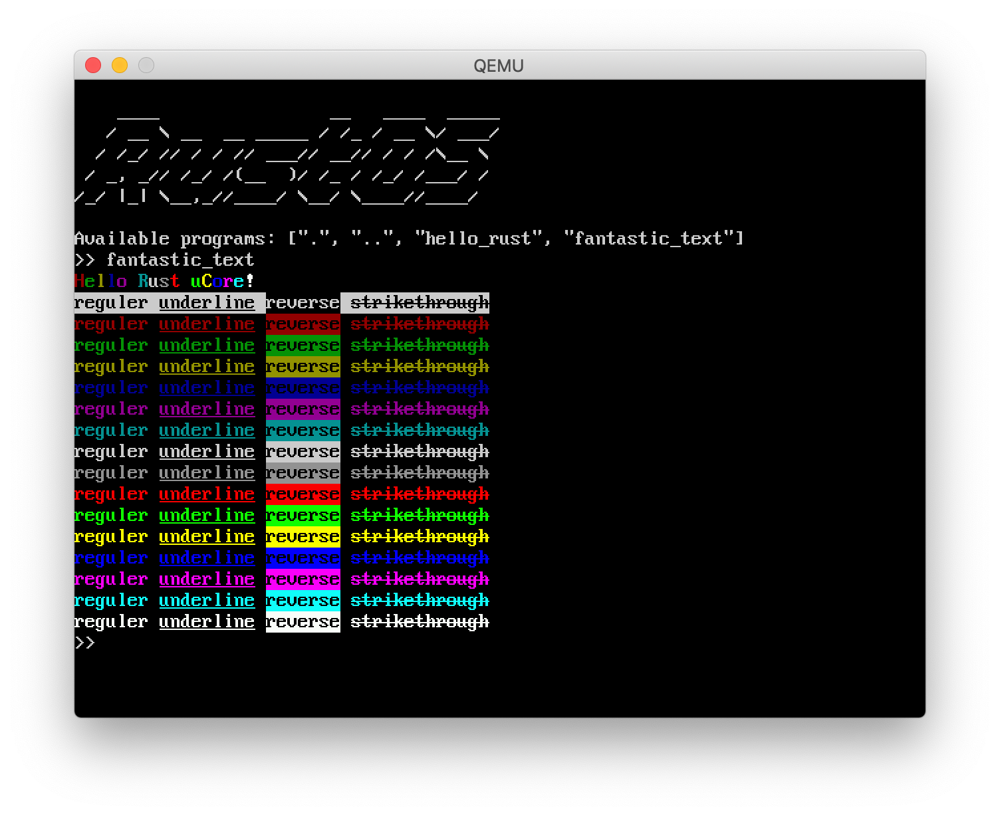

# 设备驱动

树莓派上有着丰富的外围设备(peripherals)，物理地址空间 `0x3F000000~0x3FFFFFFF` 专门用于访问外围设备。

一个设备一般提供多个可供访问的 IO 地址，一般 4 字节对齐。将它们按给定的偏移构造结构体，并使用 crate [volatile](https://crates.io/crates/volatile) 抽象为一些寄存器，可方便地对这些 IO 地址进行读写，例如：

```rust
const INT_BASE: usize = IO_BASE + 0xB000 + 0x200;

#[repr(C)]
#[allow(non_snake_case)]
struct Registers {
    IRQBasicPending: ReadOnly<u32>,
    IRQPending: [ReadOnly<u32>; 2],
    FIQControl: Volatile<u32>,
    EnableIRQ: [Volatile<u32>; 2],
    EnableBasicIRQ: Volatile<u32>,
    DisableIRQ: [Volatile<u32>; 2],
    DisableBasicIRQ: Volatile<u32>,
}

pub fn new() -> Controller {
    Controller {
        registers: unsafe { &mut *(INT_BASE as *mut Registers) },
    }
}
```

这些外围设备的最底层驱动实现在 crate [bcm2837](../../../crate/bcm2837/) 中，包括：

* GPIO
* Interrupt
* Mini UART
* Mailbox
* Timer

一些稍微高级的与具体硬件板子相关的驱动实现在 [kernel/src/arch/aarch64/board/raspi3](../../../kernel/src/arch/aarch64/board/raspi3/) 中，包括：

* Framebuffer
* Mailbox property interface
* Serial

更高级的硬件无关的驱动实现在 [kernel/src/arch/aarch64/driver](../../../kernel/src/arch/aarch64/driver/) 中，包括：

* Console

## GPIO

> 参考：BCM2837 ARM Peripherals: chapter 6, General Purpose I/O (GPIO).

目前 RustOS 中的 GPIO 驱动只是为了初始化 mini UART 而使用，实现在 crate [bcm2837](../../../crate/bcm2837/) 的 [gpio.rs](../../../crate/bcm2837/src/gpio.rs) 中。主要提供两个功能：

* 设置引脚模式
* 设置引脚上拉/下拉状态

### 设置引脚模式

引脚模式有 8 种：输入、输出与 alternative function 0~5。根据引脚编号向相应的 GPFSELx 寄存器的相应位写入模式代码即可。

```rust
pub fn into_alt(self, function: Function) -> Gpio<Alt> {
    let select = (self.pin / 10) as usize;
    let offset = 3 * (self.pin % 10) as usize;
    self.registers.FSEL[select].update(|value| {
        *value &= !(0b111 << offset);
        *value |= (function as u32) << offset;
    });
    self.transition()
}

pub fn into_output(self) -> Gpio<Output> {
    self.into_alt(Function::Output).transition()
}

pub fn into_input(self) -> Gpio<Input> {
    self.into_alt(Function::Input).transition()
}
```

### 设置引脚上拉/下拉状态

引脚的上拉/下拉状态有 3 种：上拉(`10`)、下拉(`01`)与不拉(`00`)。设置该状态的流程如下：

1. 向 GPPUD 寄存器写入状态代码。
2. 等待 150 个时钟周期。
3. 根据引脚编号向相应的 GPPUDCLK0/1 寄存器的相应位写入 1。
4. 等待 150 个时钟周期。
5. 向 GPPUD 寄存器写入 0。
6. 根据引脚编号向相应的 GPPUDCLK0/1 寄存器的相应位写入 0。

```rust
pub fn set_gpio_pd(&mut self, pud_value: u8) {
    let index = if self.pin >= 32 { 1 } else { 0 };

    self.registers.PUD.write(pud_value as u32);
    delay(150);
    self.registers.PUDCLK[index as usize].write((1 << self.pin) as u32);
    delay(150);
    self.registers.PUD.write(0);
    self.registers.PUDCLK[index as usize].write(0);
}
```

## Interrupt

> 参考：BCM2837 ARM Peripherals: chapter 7, Interrupts.

该设备为其他外围设备提供异步异常(中断)支持，实现在 crate [bcm2837](../../../crate/bcm2837/) 的 [interrupt.rs](../../../crate/bcm2837/src/interrupt.rs) 中。目前只有对 IRQ 的支持，没有对 FIQ 的支持。

当中断发生时，IRQ basic pending 寄存器中的某些位会被设置，表示哪个 basic IRQ 待处理(详见 BCM2837 ARM Peripherals 第 114 页的表)。如果其第 8 或 9 位被设置，则需要进一步到 IRQ pending 1/2 寄存器中去查找。此时共有 64 个中断，部分如下(详见第 113 页的表)：

|  编号  |       中断       |
|--------|------------------|
|   1    |  system timer 1  |
|   3    |  system timer 3  |
|   9    |  USB controller  |
|   29   |     Aux int      |
|   49   |     gpio[0]      |
|   50   |     gpio[1]      |
|   51   |     gpio[2]      |
|   52   |     gpio[3]      |
|   57   |     uart_int     |
|  ...   |       ...        |

目前 RustOS 只支持上表中的 IRQ，不支持其他 basic IRQ。在 RustOS 中用到了 System Timer 与 mini UART 的 IRQ，分别为 system timer 1 (1) 与 Aux int (29)。

在 [kernel/src/arch/aarch64/board/raspi3/irq.rs](../../../kernel/src/arch/aarch64/board/raspi3/irq.rs#L23) 中实现了 IRQ 的注册，只需调用 `register_irq()` 函数绑定 IRQ 编号与处理函数，在 `handle_irq()` 里就会自动处理已注册的中断。

### 启用与禁用中断

只需分别向 Enable IRQs 1/2 和 Disable IRQs 1/2 寄存器的相应位写 1 即可：

```rust
pub fn enable(&mut self, int: Interrupt) {
    self.registers.EnableIRQ[int as usize / 32].write(1 << (int as usize) % 32);
}

pub fn disable(&mut self, int: Interrupt) {
    self.registers.DisableIRQ[int as usize / 32].write(1 << (int as usize) % 32);
}
```

### 获取待处理的中断

只需读取 IRQ pending 1/2 寄存器中的相应位，就能知道某一 IRQ 是否待处理：

```rust
pub fn is_pending(&self, int: Interrupt) -> bool {
    self.registers.IRQPending[int as usize / 32].read() & (1 << (int as usize) % 32) != 0
}
```

此外也可将当前所有待处理的 IRQ 构成一个迭代器方便遍历：

```rust
pub struct PendingInterrupts(u64);

impl Iterator for PendingInterrupts {
    type Item = usize;

    #[inline]
    fn next(&mut self) -> Option<Self::Item> {
        let int = self.0.trailing_zeros();
        if int < 64 {
            self.0 &= !(1 << int);
            Some(int as usize)
        } else {
            None
        }
    }
}

pub fn pending_interrupts(&self) -> PendingInterrupts {
    let irq1 = self.registers.IRQPending[0].read() as u64;
    let irq2 = self.registers.IRQPending[1].read() as u64;
    PendingInterrupts((irq2 << 32) | irq1)
}
```

## Mini UART

> 参考：BCM2837 ARM Peripherals: chapter 2, Auxiliaries: UART1 & SPI1, SPI2; chapter 6, General Purpose I/O (GPIO), page 101~102.

Mini UART 可用于树莓派与上位机直接的通信，一般被称为“串口”。该驱动实现简单，在没有显示器、键盘等驱动时是一种非常好的输入输出设备。

RustOS 中 mini UART 的驱动主要实现在 crate [bcm2837](../../../crate/bcm2837/) 的 [mini_uart.rs](../../../crate/bcm2837/src/mini_uart.rs) 中。在 [kernel/src/arch/aarch64/board/raspi3/serial.rs](../../../kernel/src/arch/aarch64/board/raspi3/serial.rs) 中将其封装为了一个 `SerialPort`，以便通过统一的接口调用。

### 初始化

初始化 mini UART 的流程如下：

1. 向 AUX_ENABLES 寄存器写 1，启用 mini UART。
2. 将 GPIO 的 14/15 引脚都设为 alternative function ALT5 (TXD1/RXD1) 模式，并都设为不拉状态。
3. 配置 mini UART 参数：

    1. 暂时禁用接收器与发送器。
    2. 启用接收中断，禁用发送中断。
    3. 设置数据大小为 8 bit。
    4. 设置 RTS line 为 high。
    5. 设置波特率为 115200。
    6. 重新启用接收器与发送器。

```rust
pub fn init(&mut self) {
    // Enable the mini UART as an auxiliary device.
    unsafe { (*AUX_ENABLES).write(1) }

    Gpio::new(14).into_alt(Function::Alt5).set_gpio_pd(0);
    Gpio::new(15).into_alt(Function::Alt5).set_gpio_pd(0);

    self.registers.AUX_MU_CNTL_REG.write(0); // Disable auto flow control and disable receiver and transmitter (for now)
    self.registers.AUX_MU_IER_REG.write(1); // Enable receive interrupts and disable transmit interrupts
    self.registers.AUX_MU_LCR_REG.write(3); // Enable 8 bit mode
    self.registers.AUX_MU_MCR_REG.write(0); // Set RTS line to be always high
    self.registers.AUX_MU_BAUD_REG.write(270); // Set baud rate to 115200

    self.registers.AUX_MU_CNTL_REG.write(3); // Finally, enable transmitter and receiver
}
```

### 读

```rust
pub fn has_byte(&self) -> bool {
    self.registers.AUX_MU_LSR_REG.read() & (LsrStatus::DataReady as u8) != 0
}

pub fn read_byte(&self) -> u8 {
    while !self.has_byte() {}
    self.registers.AUX_MU_IO_REG.read()
}
```

### 写

```rust
pub fn write_byte(&mut self, byte: u8) {
    while self.registers.AUX_MU_LSR_REG.read() & (LsrStatus::TxAvailable as u8) == 0 {}
    self.registers.AUX_MU_IO_REG.write(byte);
}
```
## Timer

BCM283x 系列可用下列三种不同的时钟：

* System Timer：BCM2837 ARM Peripherals 第 12 章，IO 基地址为 `0x3F003000`，最常用的时钟，但是在 QEMU 中不可用。
* ARM Timer：BCM2837 ARM Peripherals 第 14 章，IO 基地址为 `0x3F00B400`，在 QEMU 中也不可用，RustOS 并未实现。
* Generic Timer：ARMv8 Reference Manual 第 D10 章，通过 AArch64 系统寄存器访问 CPU 的时钟，外围设备只提供了中断控制(IO 基地址为 `0x40000000`)，可同时在 QEMU 与真机上使用。

时钟主要实现在 crate [bcm2837](../../../crate/bcm2837/) 的 [timer](../../../crate/bcm2837/src/timer) 模块中。可以指定 crate bcm2837 的 feature `use_generic_timer` 来选择是否使用 Generic Timer。在 [mod.rs](../../../crate/bcm2837/src/timer/mod.rs#L12) 中提供了以下 `trait`，具体的时钟驱动需要实现这些函数：

```rust
/// The Raspberry Pi timer.
pub trait BasicTimer {
    /// Returns a new instance.
    fn new() -> Self;

    /// Initialization timer.
    fn init(&mut self);

    /// Reads the timer's counter and returns the 64-bit counter value.
    /// The returned value is the number of elapsed microseconds.
    fn read(&self) -> u64;

    /// Sets up a match in timer 1 to occur `us` microseconds from now. If
    /// interrupts for timer 1 are enabled and IRQs are unmasked, then a timer
    /// interrupt will be issued in `us` microseconds.
    fn tick_in(&mut self, us: u32);

    /// Returns `true` if timer interruption is pending. Otherwise, returns `false`.
    fn is_pending(&self) -> bool;
}
```

在 [kernel/src/arch/aarch64/board/raspi3/timer.rs](../../../kernel/src/arch/aarch64/board/raspi3/timer.rs) 中对这些函数进行了简单封装。在 [kernel/src/arch/aarch64/board/raspi3/irq.rs](../../../kernel/src/arch/aarch64/board/raspi3/irq.rs#L9) 的 `handler_irq()` 函数中处理了时钟中断：

```rust
let controller = bcm2837::timer::Timer::new();
if controller.is_pending() {
    super::timer::set_next();
    crate::trap::timer();
}
```

### System Timer

> 参考：BCM2837 ARM Peripherals: chapter 12, System Timer.

System Timer 通过 CS、CLO、CHI 等 IO 地址访问时钟，通过上文 Interrupt 节描述的 IRQ 控制器提供中断(IRQ 编号为 system timer 1)。实现方式如下：

* 初始化：使用 [interrupt](../../../crate/bcm2837/src/interrupt.rs#L68) 模块的 `enable()` 函数启用 system timer 1 IRQ。
* 当前时刻：分别读取时钟计数器的高、低 32 位(CLO、CHI)，再拼接起来得到 64 位计数器值(单位微秒)。
* 设置下一次中断的时刻：向 System Timer Compare 1 (C1) 寄存器写入当前计数器值加上时间间隔，同时向 System Timer Control/Status (CS) 寄存器的第 1 位写入 1 表示当前的中断已被处理好。
* 判断是否有时钟中断：使用 [interrupt](../../../crate/bcm2837/src/interrupt.rs#L78) 模块的 `is_pending()` 函数。

```rust
fn init(&mut self) {
    Controller::new().enable(Interrupt::Timer1);
}

fn read(&self) -> u64 {
    let low = self.registers.CLO.read();
    let high = self.registers.CHI.read();
    ((high as u64) << 32) | (low as u64)
}

fn tick_in(&mut self, us: u32) {
    let current_low = self.registers.CLO.read();
    let compare = current_low.wrapping_add(us);
    self.registers.COMPARE[SystemTimerId::Timer1 as usize].write(compare);
    self.registers.CS.write(1 << (SystemTimerId::Timer1 as usize)); // unmask
}

fn is_pending(&self) -> bool {
    let controller = Controller::new();
    controller.is_pending(Interrupt::Timer1)
}
```

### Generic Timer

> 参考：
> 1. ARMv8 Reference Manual: chapter D10, The Generic Timer in AArch64 state.
> 2. BCM2836 ARM-local peripherals (Quad-A7 control): section 4.6, Core timers interrupts; section 4.10, Core interrupt sources.

RustOS 实现的 Generic Timer 是 CPU 在 EL1 下的 Physical Timer，可通过下列 AArch64 系统寄存器访问：

|  Generic Timer 系统寄存器  |                        名称                        |                      描述                      |
|----------------------------|----------------------------------------------------|------------------------------------------------|
|        `CNTFRQ_EL0`        |          Counter-timer Frequency register          |  获取时钟的频率，单位 Hz，典型的值为 62.5 MHz  |
|        `CNTP_CTL_EL0`       |   Counter-timer Physical Timer Control register    |  控制 Physical Timer 是否启用，中断是否屏蔽等  |
|      `CNTP_TVAL_EL0`       |  Counter-timer Physical Timer TimerValue register  |       下一次时钟中断要再经过多少时钟周期。每当时钟计数器增加 1，该值就会减少 1，如果该值为 0 了就会触发时钟中断 |
|        `CNTPCT_EL0`        |       Counter-timer Physical Count register        |               获取时钟计数器的值               |

而 Generic Timer 的中断控制器需要通过 `0x40000000` 开始的那些 IO 地址访问。Generic Timer 实现方式如下：

* 初始化：将 `CNTP_CTL_EL0` 寄存器的 ENABLE 位置为 1，启用 CPU Physical Timer；将 Core0 timers Interrupt control 的 CNTPNSIRQ 位置为 1，开启中断。
* 当前时刻：读取 `CNTPCT_EL0` 寄存器获得当前时钟计数器的值，再与时钟频率 `CNTFRQ_EL0` 经过简单的换算即能得到以微秒为单位的当前时刻。
* 设置下一次中断的时刻：向 `CNTP_TVAL_EL0` 寄存器写入时间间隔对应的时钟周期数。
* 判断是否有时钟中断：判断 Core0 IRQ Source 的 CNTPNSIRQ 位是否为 1。

```rust
fn init(&mut self) {
    self.registers.CORE_TIMER_IRQCNTL[0].write(1 << (CoreInterrupt::CNTPNSIRQ as u8));
    CNTP_CTL_EL0.write(CNTP_CTL_EL0::ENABLE::SET);
}

fn read(&self) -> u64 {
    let cntfrq = CNTFRQ_EL0.get(); // 62500000
    (CNTPCT_EL0.get() * 1000000 / (cntfrq as u64)) as u64
}

fn tick_in(&mut self, us: u32) {
    let cntfrq = CNTFRQ_EL0.get(); // 62500000
    CNTP_TVAL_EL0.set(((cntfrq as f64) * (us as f64) / 1000000.0) as u32);
}

fn is_pending(&self) -> bool {
    self.registers.CORE_IRQ_SRC[0].read() & (1 << (CoreInterrupt::CNTPNSIRQ as u8)) != 0
}
```

## Mailbox

> 参考：https://github.com/raspberrypi/firmware/wiki/Mailboxes

Mailbox 是树莓派上 ARM CPU 与 VideoCore IV GPU 之间通信的渠道。Mailbox 能够识别一段按特定格式存储的请求指令，包含请求代码、请求长度、请求参数等信息，GPU 会根据请求的指令完成相应的操作，并将结果写在原处。

BCM283x 系列有两个 mailbox，一般 MB0 总是用于 GPU 向 CPU 发送消息 MB1 总是用于 CPU 向 GPU 发送消息，对 CPU 来说即一个只读一个只写。

Mailbox 有若干通道(channels)，不同通道提供不同种类的功能。一般使用 property tags 通道(编号为 8)，即 mailbox property interface。

### 基本读写

> 参考：https://github.com/raspberrypi/firmware/wiki/Accessing-mailboxes

对 mailbox 的基本读写实现在 crate [bcm2837](../../../crate/bcm2837/) 的 [mailbox.rs](../../../crate/bcm2837/src/mailbox.rs) 中。一般一次操作是向 mailbox 写入请求的地址，然后读 mailbox 来轮询等待操作完成。注意读写 mailbox 时只有数据的高 28 位有效，低 4 位被用于存放通道，所以如果写入的是一个地址则该地址必须 16 字节对齐。

读的流程如下：

1. 读状态寄存器 MAIL0_STA，直到 empty 位没有被设置。
2. 从 MAIL0_RD 寄存器读取数据。
3. 如果数据的最低 4 位不与要读的通道匹配，则回到 1。
4. 否则返回数据的高 28 位。

```rust
pub fn read(&self, channel: MailboxChannel) -> u32 {
    loop {
        while self.registers.MAIL0_STA.read() & (MailboxStatus::MailboxEmpty as u32) != 0 {}
        let data = self.registers.MAIL0_RD.read();
        if data & 0xF == channel as u32 {
            return data & !0xF;
        }
    }
}
```

写的流程如下：

1. 读状态寄存器 MAIL1_STA，直到 full 位没有被设置。
2. 将数据(高 28 位)与通道(低 4 位)拼接，写入 MAIL1_WRT 寄存器。

```rust
pub fn write(&mut self, channel: MailboxChannel, data: u32) {
    while self.registers.MAIL1_STA.read() & (MailboxStatus::MailboxFull as u32) != 0 {}
    self.registers.MAIL1_WRT.write((data & !0xF) | (channel as u32));
}
```

### Mailbox property interface

> 参考：https://github.com/raspberrypi/firmware/wiki/Mailbox-property-interface

Mailbox property interface 提供了丰富的访问底层硬件的接口，包括电源、温度、DMA、GPU、内存、Framebuffer 等模块。RustOS 中封装了一系列 mailbox property interface 函数，实现在 [kernel/src/arch/aarch64/board/raspi3/mailbox.rs](../../../kernel/src/arch/aarch64/board/raspi3/mailbox.rs) 中。

向 mailbox property interface 发送的请求需要符合一定的格式。在 RustOS 中，对 mailbox property interface 的一个功能调用被称为一个 `PropertyMailboxTag`，格式如下：

```rust
#[repr(C, packed)]
struct PropertyMailboxTag<T: Sized> {
    id: PropertyMailboxTagId,
    buf_size: u32,
    req_resp_size: u32,
    buf: T,
}
```

这里的 `buf` 一般是一个 32 位无符号整数的数组。一个或多个 `PropertyMailboxTag` 可构成一个 `PropertyMailboxRequest`，这是最终需要向 mailbox 发送的请求，格式如下：

```rust
#[repr(C, packed)]
struct PropertyMailboxRequest<T: Sized> {
    buf_size: u32,
    req_resp_code: PropertyMailboxStatus,
    buf: T,
    end_tag: PropertyMailboxTagId,
}
```

这里的 `buf` 可以是多个大小不一的 `PropertyMailboxTag` 构成的数组，不过内存布局必须连续而没有空隙。

为了方便构造这两个结构体，定义了宏 `send_one_tag!()` 与 `send_request!()`：

* `send_request!($tags: ident)`：发送一个或多个 `PropertyMailboxTag`。这会构建一个 16 字节对齐的 `PropertyMailboxRequest` 结构体，将其地址写入 mailbox。等待 GPU 操作完毕后，返回被修改过的 `PropertyMailboxTag` 列表。

* `send_one_tag!($id: expr, [$($arg: expr),*])`：这会根据 `id` 与 32 位无符号整数的数组构造一个 `PropertyMailboxTag` 结构体，然后通过宏 `send_request!()` 发送给 mailbox，返回被修改过的数组。

有了这两个宏，就可以非常方便地实现所需的 mailbox property interface 功能了。例如获取 framebuffer 物理分辨率：

```rust
pub fn framebuffer_get_physical_size() -> PropertyMailboxResult<(u32, u32)> {
    let ret = send_one_tag!(RPI_FIRMWARE_FRAMEBUFFER_GET_PHYSICAL_WIDTH_HEIGHT, [0, 0])?;
    Ok((ret[0], ret[1]))
}
```

`framebuffer_alloc()` 函数是一次性发送多个大小不一的 `PropertyMailboxTag` 的例子。

需要注意的是，当启用 MMU 与 cache 后，在访问 mailbox 的前后都需要刷新整个 `PropertyMailboxRequest` 结构的数据缓存，因为这里涉及到 GPU 与 CPU 的数据共享，必须时刻保证主存与 cache 中数据的一致性。

## Framebuffer

Framebuffer 是一块内存缓存区，树莓派的 GPU 会将其中的数据转换为 HDMI 信号，输出给显示器。Framebuffer 的底层访问接口通过 mailbox property interface 实现。在 RustOS 中，树莓派的 framebuffer 实现在 [kernel/src/arch/aarch64/board/raspi3/fb.rs](../../../kernel/src/arch/aarch64/board/raspi3/fb.rs) 中。

### 相关数据结构

[fb.rs](../../../kernel/src/arch/aarch64/board/raspi3/fb.rs) 中定义了下列结构体：

* `FramebufferInfo`：framebuffer 的信息，包括：

    + 实际可见的分辨率 `xres`、`yres`
    + 虚拟的分辨率 `xres_virtual`、`yres_virtual`
    + 位置偏移 `xoffset`、`yoffset`
    + 颜色深度 `depth`
    + 一行的字节数 `pitch`
    + GPU 总线地址 `bus_addr`
    + 大小 `screen_size`

* `ColorDepth`：表示颜色深度的枚举值，目前支持 16 位和 32 位颜色深度。
* `ColorBuffer`：一个 union 类型，可将同一个 framebuffer 基址解析为下列三种类型：

    + 一个 32 位无符号整数，表示 framebuffer 基址的虚拟地址。
    + 一个类型为 16 位整数，大小为 framebuffer 分辨率的数组，表示 16 位颜色深度下的每个像素点。
    + 一个类型为 32 位整数，大小为 framebuffer 分辨率的数组，表示 32 位颜色深度下的每个像素点。

    ```rust
    union ColorBuffer {
        base_addr: usize,
        buf16: &'static mut [u16],
        buf32: &'static mut [u32],
    }
    ```

    该 union 还提供了 `read16()`、`write16()`、`read32()`、`write32()` 等函数用于直接读写不同颜色深度下的 framebuffer。

* `Framebuffer`：具体的 framebuffer 结构体：

    ```rust
    pub struct Framebuffer {
        pub fb_info: FramebufferInfo,
        pub color_depth: ColorDepth,
        buf: ColorBuffer,
    }
    ```

### 初始化

Framebuffer 在函数 `Framebuffer::new()` 中初始化。流程如下：

1. 通过 mailbox property interface，获取 framebuffer 物理分辨率、颜色深度等信息。也可以不获取，而是手动设置。
2. 设置好相关参数，调用 `mailbox::framebuffer_alloc()` 由 GPU 分配 framebuffer，构造出 `FramebufferInfo` 结构体。
3. 将 framebuffer GPU 总线地址转换为物理内存地址，然后调用 `memory::ioremap()` 将这段内存做对等映射，内存属性为 NormalNonCacheable。
4. 构造出 `Framebuffer` 结构体并返回。

### 读写

可通过 `Framebuffer::read()` 和 `Framebuffer::write()` 函数读取 framebuffer 中的一个像素，或写入一个像素。

为了提升连续区域读写的速度，还实现了 `Framebuffer::copy()` 与 `Framebuffer::fill()` 函数，分别用于拷贝一块区域、将一块区域都置为同一颜色。具体做法是将连续几个像素拼成一个 64 位整数，以减少访存次数。

`Framebuffer::clear()` 函数用于将屏幕清空(黑屏)。

## Console

有了 framebuffer，就可以将显示器作为输出设备显示字符了。为此
Console (控制台) 是一个平台无关的抽象输出设备，表示屏幕上要显示的字符矩阵。该设备负责将字符转成像素点写入 framebuffer 中，以实现显示器中字符的显示，并支持颜色、字体等多种效果。

Console 驱动实现在模块 [kernel/src/arch/aarch64/driver/console](../../../kernel/src/arch/aarch64/driver/console/) 中，依赖 framebuffer，包含下面几部分：

1. 控制台主体([mod.rs](../../../kernel/src/arch/aarch64/driver/console/mod.rs))
2. 颜色([color.rs](../../../kernel/src/arch/aarch64/driver/console/color.rs))
3. 字体([fonts](../../../kernel/src/arch/aarch64/driver/console/fonts))
4. ANSI 转移序列解析器([escape_parser.rs](../../../kernel/src/arch/aarch64/driver/console/escape_parser.rs))

### 控制台主体

包含下列结构体：

* `ConsoleChar`：控制台中的字符，由 ASCII 码 `ascii_char` 与字符属性 `attr` (详见下节“ANSI 转移序列解析器”)构成。
* `ConsoleBuffer`：控制台字符缓冲区，是一个 `num_row` 行 `num_col` 列，元素类型是 `ConsoleChar` 的二维数组。主要包含以下函数：

    + `write()`：向 `(row, col)` 处写入一个字符 `ch`。这会根据给定的字体与字符属性，将字符转成像素点呈现在 framebuffer 上。
    + `new_line()`：向字符缓冲区的底部插入一个新行，并将原来的内容都向上平移一行。在真机上测试时，发现 framebuffer 读的速度非常慢，所以没有用 `Framebuffer::copy()` 函数直接拷贝 framebuffer 内容，而是根据新的字符缓冲区重新绘制。
    + `clear()`：清空屏幕与字符缓冲区内容。

* `Console`：具体的控制台结构体，通过传入的字体泛型 `<F: Font>` 构造，包含当前光标位置 `(row, col)`、 ANSI 转移序列解析器 `parser` 以及控制台字符缓冲区 `buffer`，主要包含以下函数：

    + `new()`：根据 `FramebufferInfo` 新建一个 `Console` 对象。当前字体下字符的高、宽与 framebuffer 分辨率将决定字符缓冲区的大小。
    + `write_byte()`：向当前光标位置处写入一个字符。这会根据具体是什么字符进行相应的操作，包括：直接显示该字符、换行、删除前一个字符、传给转移序列解析器。
    + `new_line()`：换行。如果当前光标位于字符缓冲区最底部则会调用 `ConsoleBuffer::new_line()` 移动屏幕内容。
    + `clear()`：清空并初始化。

    此外，`Console` 实现了 trait `fmt::Write` 的 `write_str()` 函数，这样就可以用 `write_fmt()` 格式化输出了。

### 颜色

该模块定义了 16 种颜色(8 种标准颜色与 8 种高亮的标准颜色)，并提供了将 RGB 值转换为 framebuffer 可识别的 16/32 位像素值的方法。

### 字体

该模块定义了统一的字体接口：

```rust
pub trait Font {
    const HEIGHT: usize;
    const WIDTH: usize;

    /// the `y` coordinate of underline.
    const UNDERLINE: usize;
    /// the `y` coordinate of strikethrough.
    const STRIKETHROUGH: usize;

    /// Whether the character `byte` is visible at `(x, y)`.
    fn get(byte: u8, x: usize, y: usize) -> bool;
}
```

添加一种字体只需实现该 trait 即可，支持下划线与删除线。目前内置了一种 8x16 的字体(直接从 linux 中拷贝而来，[CP437 编码](https://en.wikipedia.org/wiki/Code_page_437))。

### ANSI 转移序列解析器

> 参考：https://en.wikipedia.org/wiki/ANSI_escape_code

为了在控制台上支持文字颜色等选项，RustOS 实现了一个简易的 ANSI 转移序列(ANSI escape sequences)解析器，可识别标准的ANSI 转移序列并呈现在屏幕上，支持下列 SGR (Select Graphic Rendition) 字符属性：

|  SGR 代码  |          效果          |
|------------|------------------------|
|     0      |       重置为默认       |
|     4      |         下划线         |
|     7      |    反转前景与背景色    |
|     9      |         删除线         |
|     24     |       取消下划线       |
|     27     |  取消反转前景与背景色  |
|     29     |       取消删除线       |
|   30~37    |       设置前景色       |
|   40~47    |       设置背景色       |
|   90~97    |     设置高亮前景色     |
|  100~107   |     设置高亮背景色     |

具体实现时，结构体 `EscapeParser` 维护了一个状态机，通过 `parse()` 函数传入一个字符，转移状态，解析出 SGR 参数并更新当前字符属性；通过 `char_attribute()` 函数获取当前的字符属性。

目前显示效果与在终端下使用 `screen` 获取串口输出的效果一致，如在 QEMU 中运行 `fantastic_text` 测例的效果如下：


