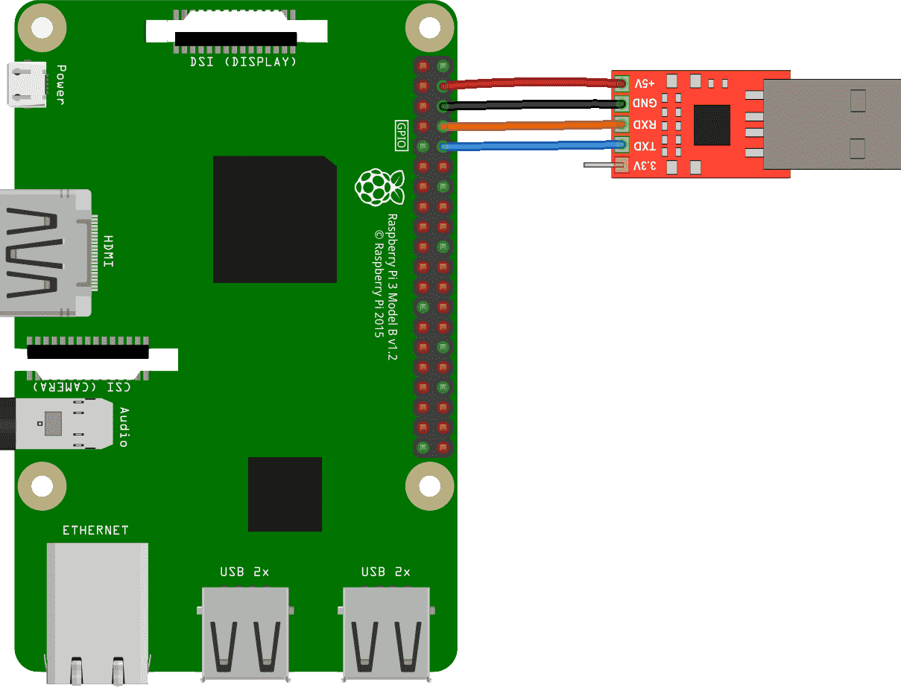

# 环境配置

## 软件需求

* [Rust](https://www.rust-lang.org/) nightly 编译器

    ```
    curl https://sh.rustup.rs -sSf | sh
    rustup component add rust-src
    ```

* Cargo tools: [cargo-xbuild](https://github.com/rust-osdev/cargo-xbuild)

    ```
    cargo install cargo-xbuild
    ```

* [QEMU](https://www.qemu.org/) >= 3.0.0
* [AArch64 GNU toolchain](https://web.stanford.edu/class/cs140e/assignments/0-blinky/)

    + macOS: 从 [homebrew](https://brew.sh/) 安装：

        ```
        brew tap SergioBenitez/osxct
        brew install aarch64-none-elf
        ```

    + Linux: 下载 [aarch64-none-elf-linux-x64.tar.gz](https://web.stanford.edu/class/cs140e/files/aarch64-none-elf-linux-x64.tar.gz) 并解压到任意目录。

## 硬件需求

* 1 块 Raspberry Pi 3 Model A+/B/B+
* 1 块 4GB 及以上的 microSD 卡与读卡器
* 1 个 CP2102 USB 转 TTL 模块
* 若干杜邦线

## 在模拟器中运行

* 构建并运行

    ```
    git clone https://github.com/wangrunji0408/RustOS.git --recursive
    cd RustOS/kernel
    rustup override set nightly
    make run arch=aarch64 [board=raspi3]
    ```

* 使用 GDB 调试

    ```
    make debug arch=aarch64
    ```

* 反汇编

    ```
    make asm arch=aarch64
    ```

* 更多 Makefile 选项

    * `mode=debug|release`：指定 `debug` 还是 `release` 模式。默认 `debug`。
    * `graphic=on|off`：是否启用图形输出。默认 `on`。
    * `smp=1|2|3|4|...`：指定 SMP 的核数。目前 AArch64 的 SMP 未实现，该选项无效。
    * `raspi3_timer=system|generic`：使用 Raspberry Pi 的 System Timer 还是 Generic Timer。默认 `generic`，且在 QEMU 中只能使用 Generic Timer。
    * `prefix=<prefix>`：指定 AArch64 工具链前缀。默认 `aarch64-none-elf-`，某些 Linux 中的工具链前缀为 `aarch64-linux-gnu-`。
    * `LOG=off|error|warn|info|debug|trace`：指定输出日志的级别。默认 `warn`。
    * `SFSIMG=<sfsimg>`：用户程序 SFS 镜像路径。默认 `../user/img/ucore-aarch64.img`，即用 C 语言编写的直接从原 uCore 中移植过来的用户程序。如欲使用 Rust 编写的用户程序可将其设为 `../user/build/user-aarch64.img`。

## 在真机上运行

1. 往 SD 卡中写入 [Raspbian](https://www.raspberrypi.org/downloads/raspbian/) 原版系统镜像：直接看 <https://www.raspberrypi.org/documentation/installation/installing-images>。然后需要将原版的 `config.txt` 替换为 [tools/raspi-firmware/config.txt](../../../tools/raspi-firmware/config.txt)。

2. 写入 RustOS 内核镜像：

    ```
    make install arch=aarch64
    ```

3. 连接 Raspberry Pi、CP2102 模块与 PC：

    

    注意最好使用 Raspberry Pi 自带的电源适配器供电，而不要用 CP2102 模块的 +5V 供电(即不用连上图中的红线)。

4. 使用 [screen](https://www.gnu.org/software/screen/manual/screen.html#Overview) 与串口进行通信：

    ```
    screen /dev/<your-path> 115200
    ```

    在 macOS 中 CP2102 模块的设备路径一般为 `/dev/tty.SLAB_USBtoUART`，在 Linux 中一般为 `/dev/ttyUSB0`。

5. 插入 SD 卡，上电，看终端的输出结果。如果连接了 Raspberry Pi 的 HDMI 接口与显示器，还能看到显示器中有输出。


## 实用技巧

1. 从 QEMU 中退出：按 `<ctrl-a> c`，再输入 `q`。
2. 从 screen 中退出：按 `<ctrl-a> k`，再输入 `y`。
