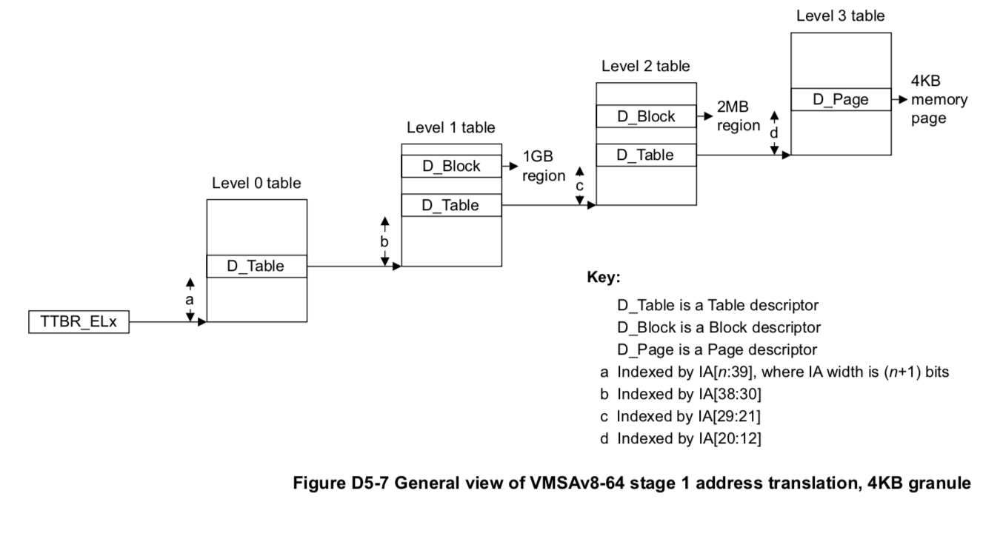
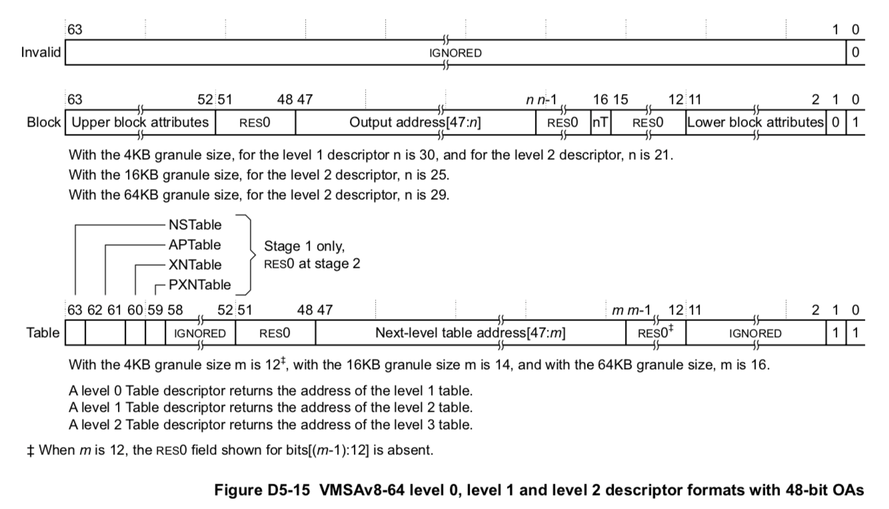
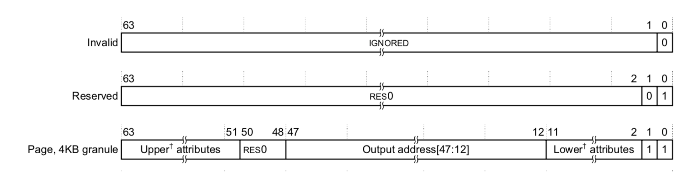
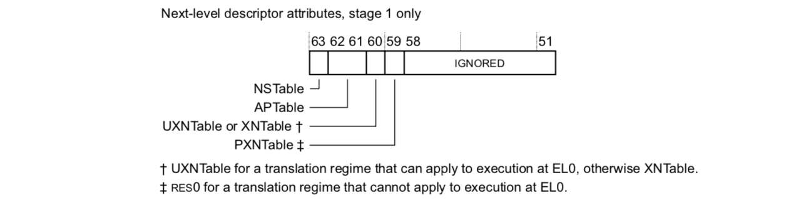
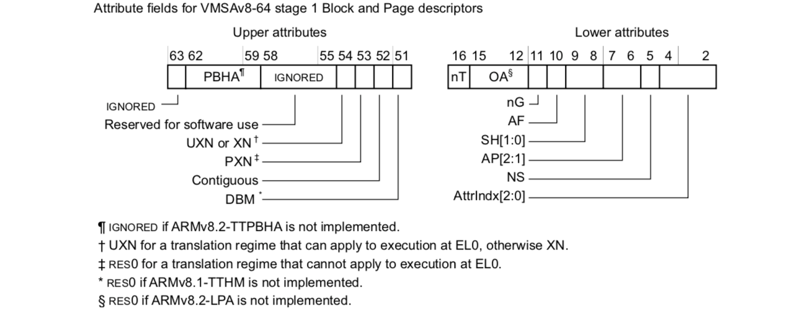

# 内存管理

## AArch64 虚拟内存系统

> 参考：ARMv8 Reference Manual: chapter D5, The AArch64 Virtual Memory System Architecture.

(注：完整的 AArch64 文档中描述了许多可选的配置，如页大小、翻译表级数等，以下描述都是指在 RustOS 中的实现，不代表只有这一种实现方式)

### 地址空间 (D5.1.3)

AArch64 拥有 64 位地址，支持两段虚拟内存地址空间，分别为：

* 低地址空间：高 16 位是 0，从 `0x0000_0000_0000_0000` 到 `0x0000_FFFF_FFFF_FFFF`
* 高地址空间：高 16 位是 1，从 `0xFFFF_0000_0000_0000` 到 `0xFFFF_FFFF_FFFF_FFFF`

在 RustOS 中，低地址空间被用于内核地址空间，高地址空间被用于用户程序地址空间。

### 地址翻译系统 (D5.2)

地址翻译系统(address translation system)，会随着 MMU 的启用而启用，负责将虚拟地址(或输入地址，IA)映射为物理地址(或输出地址，OA)。完整的翻译过程包含两个阶段 stage 1 与 stage 2，一般只使用 stage 1 的输出作为最终的物理地址。

翻译的基本流程是：给定**翻译表**(translation table，也可称为页表)的基址，截取虚拟地址中的一段 bit，将其作为索引去翻译表中查找，查得的物理地址作为下一级翻译表的基址。最后一级翻译表返回的是物理页帧(page)的基址，加上虚拟地址页内偏移即可得到原虚拟地址对应的物理地址。

第 0 级翻译表的基址保存在**翻译表基址寄存器**(Translation Table Base Register, TTBR)中，有两个，分别为  `TTBR0_EL1` 和 `TTBR1_EL1`，MMU 会根据虚拟地址是位于低地址空间还是高地址空间，自动选择对应的 TTBR。相当于低地址空间与高地址空间各用一套不同的地址翻译系统。

翻译表共有 4 级(0~3)，每级有 512 个表项，因此每级翻译表的索引为 9 位，一个翻译表的大小为 512 x 8 = 4KB。而最后得到的物理页帧的大小一般为 4KB，页内偏移有 12 字节。

一般来说，最后一级得到的物理页帧大小为 4KB，不过也可不用翻译到最后一级，而在中间的某一级就停止翻译，直接返回一个物理页帧的地址，此时该页帧的大小会大于 4KB，一般称其为**块**(block)。如在第 1 级就返回，会得到一个 1GB 的物理内存块；如在第 2 级返回，会得到一个 2MB 的物理内存块。翻译表项中有专门的位来区别该表项中的地址是下一级翻译表的基址还是一个块的基址。



使用**翻译控制寄存器**(Translation Control Register, TCR) `TCR_EL1` 可配置翻译系统的参数，常用的字段如下：

1. AS：ASID 的大小，8 位或 16位。RustOS 中为 16 位。
2. IPS：中间级物理地址大小。由于 RustOS 不使用 stage2 翻译系统，所以该地址就是物理地址。一般设为与 `ID_AA64MMFR0_EL1` 中的 `PARange` 字段一致。
3. TG0/1：低/高地址空间翻译系统的物理页帧粒度，4KB、16KB 或 64KB。RustOS 中都为 4KB。
4. SH0/1：低/高地址空间翻译系统的内存共享属性，不共享、内部共享或外部共享。RustOS 中都为内部共享。
5. ORGN0/1：低/高地址空间翻译系统的外部缓存属性。
6. IRGN0/1：低/高地址空间翻译系统的内部缓存属性。
7. EPD0/1：是否使用 `TTBR0/1_EL1` 翻译系统。RustOS 中为都使用。
8. T0/1SZ：在低/高地址空间翻译系统中，第 0 级翻译表从高往低数第几位开始索引。RustOS 中都为 16，即从第 48 位开始索引。
9. A1：ASID 定义在 `TTBR0_EL1` 还是 `TTBR1_EL1` 中。RustOS 中为 `TTBR1_EL1`。

### 翻译表描述符 (D5.3)

翻译表描述符即翻译表项，由一段地址空间的基址与这段地址空间的属性构成。根据这段地址空间的用处不同，将描述符分为 3 类：

1. **页描述符**(page descriptor)：该描述符中的地址指向一个 4KB 大小的页。
2. **块描述符**(block descriptor)：该描述符中的地址指向一个 1GB 或 2MB 大小的块。
3. **表描述符**(table descriptor)：该描述符中的地址指向另一个翻译表。

#### 第 0, 1, 2 级翻译表描述符

第 0 级翻译表只能包含表描述符，第 1、2 级翻译表同时支持表描述符与块描述符。一个描述符的各字段如下图所示：



#### 第 3 级翻译表描述符

第 3 级翻译表只能包含页描述符。一个描述符的各字段如下图所示：



#### 表描述符属性



#### 块/页描述符属性



各字段的具体说明详见官方文档 ARMv8 Reference Manual D5.3.3 节。

### 内存属性 (D5.5)

可为一段内存设置的特定属性，如可缓存性、可共享性、内存类型等。

#### 内存类型与可缓存性

可为内存设置多达 8 个不同的类型，每个类型的内存的可缓存性不同，如普通可缓存内存、普通不可缓存内存、设备内存等。
在块/页描述符的 AttrIndex 字段可设置内存的类型。关于内存类型、Device 与 Normal 内存的区别的详细资料参见 Programmer’s Guide for ARMv8-A 13.1 节。

8 种内存类型的配置通过 `MAIR_EL1` 实现，每 8 位代表一种类型的内存配置。具体参见 ARMv8 Reference Manual D12.2.82 节。

#### 可共享性

可共享性分为 3 种：

1. 不可共享，即每个核都不与其他核共享这段内存。
2. 内部共享，即多核之间可以共享这段内存。
3. 外部共享，即除了多核之间外，CPU 与 GPU 之间也可共享这段内存。

在块/页描述符的 SH 字段可设置内存的可共享性。

### TLB、Cache 操作

#### TLB 操作 (C5.5)

**TLB** (Translation Lookaside Buffers) 是翻译表的缓存，如果一个虚拟地址在 TLB 中命中，将不再通过地址翻译系统翻译，而是直接从缓存中得到物理地址。

当翻译表被修改后，需要刷新 TLB，以防由于缓存而使新的虚拟——物理地址映射不起作用。有以下两种刷新方式：

* 根据虚拟地址刷新：只会使 TLB 中的该虚拟地址无效，代码如下：

    ```armasm
    dsb ishst
    tlbi vaae1is, <vaddr>
    dsb ish
    isb
    ```

* 全部刷新：会使 TLB 中的所有表项无效，代码如下：

    ```armasm
    dsb ishst
    tlbi vmalle1is
    dsb ish
    isb
    ```

#### Cache 操作 (C5.3)

**Cache** 是主存的缓存，如果一个物理地址在 cache 中命中，将不会访问主存，而是直接从 cache 中得到数据。Cache 又分为指令 cache 与 数据 cache，分别作用在取指与普通访存时。

当通过普通访存的形式修改了代码段的数据，并跳转到了这里运行，此时需要刷新指令 cache，以防取指时从指令 cache 中取到旧的数据。指令 cache 可使用下列代码一次性全部清空：

```armasm
ic ialluis
dsb ish
isb
```

当 CPU 与 GPU 通信，共享一段内存时，由于 GPU 不使用 cache，需要保证 CPU 写入数据时一定被写入主存了而不是在 cache 中，以便 GPU 能读出正确的数据；同时，也要保证这段内存不在 cache 中，以便 GPU 对其进行修改后 CPU 能立即看到修改的结果。这时候就需要清空数据 cache 了。可使用下列代码清空一个 cache line 的数据：

```armasm
dc civac, <vaddr>
dsb sy
isb
```

Cache line 的大小可通过 `CTR_EL0` 寄存器读取，一般为 16 个 WORD，即 64 字节。

### ASID 机制 (D5.9.1)

在上下文切换时，需要修改 TTBR1_EL1 寄存器，如果不刷新 TLB 也不使用 ASID，TLB 中将会保留旧进程的虚拟——物理地址映射关系，导致进程访问错误的物理地址。不过如果每次上下文切换都刷新 TLB，开销又较大。

**ASID** (Address Space ID) 的引入就是为了避免在上下文切换过程中刷新 TLB。详见“上下文切换”相关章节。

## RustOS 中的实现

在 RustOS 中，AArch64 平台相关的内存管理主要实现在 [kernel/src/arch/aarch64/memory.rs](../../../kernel/src/arch/aarch64/memory.rs) 与 [kernel/src/arch/aarch64/paging.rs](../../../kernel/src/arch/aarch64/paging.rs) 中。此外，crate [aarch64](https://github.com/equation314/aarch64) 类似其他平台下的 x86_64、riscv 库，封装了对 AArch64 底层系统寄存器、翻译表的访问。

(注：为了保持与其他平台的一致性，下文使用“页表”指代“翻译表”，并且下文中页表的级数 1, 2, 3, 4 分别指官方文档中翻译表的级数 3, 2, 1, 0)

### 物理内存探测

### aarch64 库中的页表

与其他平台一样，页表实现在内核代码 [paging.rs](../../../kernel/src/arch/aarch64/paging.rs) 中，其实只是套了层壳，诸如 map 等复杂操作的实现位于 aarch64 库中。

#### 页表描述符

在 [aarch64/src/paging/page_table.rs](https://github.com/equation314/aarch64/blob/master/src/paging/page_table.rs) 中实现了页表(`PageTable`)与页表项(`PageTableEntry`)。页表有 512 个项，每个页表项是一个 64 位描述符。一个页表项描述符由下面 3 部分字段构成：

1. **地址**(address)：位于描述符的第 12 到 47 位。根据描述符的 `TABLE_OR_PAGE` 位，分别指向下列 3 种地址：

    1. 页描述符(page descriptor)：该地址指向一个 4KB 大小的页，该地址 4KB 对齐。
    2. 块描述符(block descriptor)：该地址指向一个 1GB 或 2MB 大小的块，该地址 1GB 或 2MB 对齐。
    3. 表描述符(table descriptor)：该地址指向另一个页表，该地址 4KB 对齐。

2. **标志位**(flags)：仅由一个位来表示的内存属性。对于表/块描述符包含下列位：

    |  位   |       名称        |                                 描述                                  |
    |------|-----------------|---------------------------------------------------------------------|
    |  0   |      VALID      |                              该描述符是否有效                               |
    |  1   |  TABLE_OR_PAGE  |                      为 0 表示是块描述符，为 1 表示是表或页描述符                      |
    |  6   |     AP_EL0      |                       这段内存是否可在 EL0 (用户态) 下访问                        |
    |  7   |      AP_RO      |                             这段内存是否是只读的                              |
    |  10  |       AF        |                          Access flag，必须为 1                          |
    |  11  |       nG        |                   是否不是全局内存。用户态内存必须设置这一位才能使用 ASID                    |
    |  51  |       DBM       |  Dirty Bit Modifier。不过 dirty 位只在 ARMv8.2 中由硬件自动设置，该位用于软件模拟 dirty 位  |
    |  52  |       PXN       |                           这段内存是否在特权级下不可执行                           |
    |  53  |       UXN       |                          这段内存是否在非特权级下不可执行                           |

    以及下列保留给软件实现特定功能的位：

    |  位   |       名称        |                                 描述                                  |
    |------|-----------------|---------------------------------------------------------------------|
    |  51  |       WRITE       |                             软件模拟的 DMB 位                             |
    |  55  |       DIRTY       |                            软件模拟的 dirty 位                            |
    |  56  |      SWAPPED      |                             软件实现的页换出标志位                             |
    |  57  |  WRITABLE_SHARED  |                        软件实现的可写共享位，用于 COW 机制                         |
    |  57  |  READONLY_SHARED  |                        软件实现的只读共享位，用于 COW 机制                         |

    对于表描述符只包含下列位：

    |  位   |       名称        |                                 描述                                  |
    |------|-----------------|---------------------------------------------------------------------|
    |  59  |     PXNTable      |                       该页表所映射的所有内存都是特权级下不可执行的                        |
    |  60  |      XNTable      |                       该页表所映射的所有内存都是非特权级下不可执行的                       |

3. **属性**(attribute)：属性字段指明了这段内存的内存属性，包括内存类型(位 2、3、4)与可共享性(位 8、9)。在 [aarch64/src/paging/memory_attribute.rs](https://github.com/equation314/aarch64/blob/master/src/paging/memory_attribute.rs) 中预定义了 3 中内存属性，分别为：

    1. Normal：普通可缓存内存，cache 属性为 Write-Back Non-transient Read-Allocate Write-Allocate，内部共享。
    2. Device：Device-nGnRE 类型的内存，不可缓存，外部共享。
    3. NormalNonCacheable：普通不可缓存内存，外部共享。

#### 自映射机制

为了方便对页表的修改，与其他平台一样，aarch64 下的 RustOS 也使用了**自映射**的页表。

具体地，设**递归索引**为 `R` (RustOS 中为 `0o777 = 512`，即页表的最后一项)，只需将第 4 级页表的第 `R` 项映射为第 4 级页表自身即可建立自映射页表。这样一来，一个虚拟地址 `IA` 的四级页表分别被以下虚拟地址所映射(`||` 表示比特串的连接)：

* 4 级页表：`R || R || R || R`
* 3 级页表：`R || R || R || IA[47..39]`
* 2 级页表：`R || R || IA[47..39] || IA[38..30]`
* 1 级页表：`R || IA[47..39] || IA[38..30] || IA[29..21]`

在 [aarch64/src/paging/recursive.rs](https://github.com/equation314/aarch64/blob/master/src/paging/recursive.rs) 中，为结构体 `RecursivePageTable` 实现了一系列函数，主要的几个如下：

* `new(table: PageTable)`：将虚拟地址表示的 `table` 作为 4 级页表，新建 `RecursivePageTable` 对象。
* `map_to(self, page: Page<Size4KiB>, frame: PhysFrame<Size4KiB>, flags: PageTableFlags, attr: PageTableAttribute, allocator: FrameAllocator<Size4KiB>)`：将虚拟地址表示的**页** `page`，映射为物理地址表示的**帧** `frame`，并设置标志位 `flags` 和属性 `attr`，如果需要新分配页表就用 `allocator` 分配。页与帧的大小都是 4KB。
* `unmap(self, page: Page<Size4KiB>)`：取消虚拟地址表示的页 `page` 的映射。

### 实现内存管理

下面是 [memory.rs](../../../kernel/src/arch/aarch64/memory.rs) 与 [paging.rs](../../../kernel/src/arch/aarch64/paging.rs) 中对内存管理的实现。

#### 启用 MMU

由于在真机上使用原子指令需要 MMU 的支持，应该尽量早地启用 MMU，而 [boot.S](../../../kernel/src/arch/aarch64/boot/boot.S) 中并没有建立页表与启用 MMU，所以启动完毕一进入 `rust_main()` 函数，就会调用 [memory.rs](../../../kernel/src/arch/aarch64/memory.rs#L20) 里的 `init_mmu_early()` 函数来启用 MMU。

该函数主要做了下面三件事：

1. 建立一个临时的地址翻译系统。

    这部分的代码主要位于 [paging.rs](../../../kernel/src/arch/aarch64/paging.rs#L14) 里的 `setup_temp_page_table()` 函数。这个地址翻译系统只是临时的，未进行细致的权限控制，更细致的地址翻译系统将在下节“重新映射内核地址空间”中建立。

    该过程共需要三个 4KB 大小的页面，分别用于第 2~4 级页表。然后按下图方式映射：

    ```
        +------------+
        |  TTBR0_EL1 |---+
        +------------+   |
                         |
                         |
                  +------+-------------------+
                  |                          |
        p4_table  v                          |
        +-----------+ 0x0000_0000_0000       |
      0 |  D_Table  |--------------------+   |
        +-----------+ 0x0080_0000_0000   |   |
        |    ...    |                    |   |
        +-----------+                    |   |
        |    ...    |                    |   |
        +-----------+ 0xFF80_0000_0000   |   |
    511 |  D_Table  |------------------------+
        +-----------+                    |
                  +----------------------+
                  |
        p3_table  v
        +-----------+ 0x0000_0000_0000
      0 |  D_Table  |--------------------+
        +-----------+ 0x0000_4000_0000   |
      1 |  D_Block  |                    |
        +-----------+ 0x0000_8000_0000   |
        |    ...    |                    |
        +-----------+                    |
        |    ...    |                    |
        +-----------+                    |
                  +----------------------+
                  |
        p2_table  v
        +-----------+ 0x0000_0000_0000
      0 |  D_Block  |
        +-----------+ 0x0000_0020_0000
      1 |  D_Block  |
        +-----------+ 0x0000_0040_0000
        |    ...    |
        +-----------+ 0x0000_3FE0_0000
    511 |  D_Block  |
        +-----------+
    ```

    注意 `4000_0000 ~ 0x8000_0000` 以及 `0x3F00_0000 ~ 0x4000_0000` 这些内存区域是 IO 地址空间，内存属性为 Device，其他内存区域属性都是 Normal。

2. 初始化 `MAIR_EL1`、`TCR_EL1` 等系统寄存器。

    `MAIR_EL1` 系统寄存器定义了三种内存属性：Normal、Device 和 NormalNonCacheable。

    `TCR_EL1` 系统寄存器用于设置翻译系统的参数(详见上文描述)。

3. 修改 `SCTLR_EL1` 寄存器以启用 MMU。

    一切准备就绪后，用下列代码启用 MMU 和 cache：

    ```rust
    unsafe { barrier::isb(barrier::SY) }
    SCTLR_EL1.modify(SCTLR_EL1::M::Enable + SCTLR_EL1::C::Cacheable + SCTLR_EL1::I::Cacheable);
    unsafe { barrier::isb(barrier::SY) }
    ```

    注意修改 `SCTLR_EL1` 系统寄存器的前后都要需要有内存屏障指令 `isb sy`。

#### 初始化内存管理

这部分实现在 [memory.rs](../../../kernel/src/arch/aarch64/memory.rs#L12) 里的 `init()` 函数中。包含下列三部分：

1. 探测物理内存，初始化物理页帧分配器：由函数 `init_frame_allocator()`，先用 atags 库探测出可用物理内存的区间 `[start, end]`，然后以 4KB 大小的页为单位插入 `FRAME_ALLOCATOR` 中。由于 Raspberry Pi 3 拥有 1GB 内存，物理页帧数多达 256K，所以需要使用 `bit_allocator::BitAlloc1M`。

2. 初始化堆分配器：直接调用 `crate::memory::init_heap()`，堆大小为 8MB。
3. 重新映射内核地址空间：由函数 `remap_the_kernel()` 完成，见下节。

#### 重新映射内核地址空间

有了物理页帧分配器后，就可以使用 `RecursivePageTable` 等结构体提高的函数映射页面，而不用像 `setup_temp_page_table()` 那样手动映射了。

在函数 `remap_the_kernel()` 中，使用了类 `MemorySet` 来管理内核使用的内存空间。新建一个 `MemorySet` 将新建一个 `InactivePageTable`，即一个非活跃页表或一套地址翻译系统。为了以后方便实现 ioremap，使用全局变量 `KERNEL_MEMORY_SET` 记录内核的 `MemorySet` 结构。

然后，该函数分别将内核的栈、代码段、数据段、只读数据段、BSS 段加入 `MemorySet`，设置好访问权限，建立 `Linear` 对等映射，这会导致调用 `ActivePageTable` 的 `map()` 函数，进而调用 `RecursivePageTable` 的 `map_to()` 函数建立映射。需要注意的是，对于 IO 地址空间 `0x3F00_0000 ~ 0x4000_1000`，额外设置了 `MemoryAttr` 的 `mmio` 属性，这将使得这段内存的内存属性为 Device。最后调用 `InactivePageTable` 的 `activate_as_kernel()` 函数向 `TTBR0_EL1` 写入新的页表基址。

如果以后想访问其他的 IO 地址空间(如 Framebuffer)，可调用 `ioremap()` 函数建立对等映射。该函数会将要映射的内存区域插入全局的 `KERNEL_MEMORY_SET` 结构，并将内存属性设为 NormalNonCacheable。

#### InactivePageTable

`InactivePageTable` 定义了一个**非活跃页表**，准确地说是由第 4 级页表基址指定的一套地址翻译系统，一般随着 `MemorySet` 的建立而建立。除了在 `remap_the_kernel()` 中建立的是内核新页表，其他时候都是用户页表。

在不同的平台下需要各自实现以下函数([paging.rs](../../../kernel/src/arch/aarch64/paging.rs#L183) 中)：

* `new_bare()`：新建一套地址翻译系统。首先调用 `alloc_frame()` 分配一个物理页帧用于存放唯一的 4 级页表，然后修改该物理页帧，使得其最后一项映射到自身，即建立自映射页表。通过调用 `active_table().with_temporary_map()` 让当前活跃的页表新建一个临时的映射，可在页表被激活后也能修改任意物理页帧。
* `token()`：获取该翻译系统的页表基址，即第 4 级页表的物理地址。
* `set_token(token)`：将页表基址 `token` 写入页表基址寄存器，用于激活该地址翻译系统。RustOS 中是写入 `TTBR1_EL1`。
* `active_token()`：获取当前活跃页表的页表基址寄存器内容。RustOS 中是读取 `TTBR1_EL1`。
* `flush_tlb()`：刷新 TLB 以立即生效对地址翻译系统的修改。
* `edit()`：让该翻译系统变得可编辑。本质上是将当前活跃页表(`TTBR0_EL1` 指向的页表)的递归索引指向该翻译系统的第 4 级页表，使得所有对该翻译系统第 1~4 级页表的访问，都可直接通过自映射机制构造相应的虚拟地址来实现。同时由于不修改当前活跃页表的其他表项，对内核地址空间可正常访问。
* `new()`：建立用户页表时调用，会同时调用 `new_bare()` 和 `map_kernel()`。不过在 AArch64 下不需要 `map_kernel()`。
* `map_kernel()`：为了让用户程序陷入中断后能访问内核地址空间，需要在用户页表中映射内核的地址空间，通过 `edit()` 函数修改自身来实现。使用 `new()` 建立用户页表时会额外调用该函数。不过在 AArch64 下可使用 `TTBR0_EL1` 与 `TTBR1_EL1` 区分内核页表与用户页表，所以 AArch64 下该函数无效。

#### 分离内核页表与用户页表

AArch64 提供了两个翻译表基址寄存器 `TTBR0_EL1` 与 `TTBR1_EL1`，MMU 会根据虚拟地址是低地址空间还是高地址空间自动选择相应的 TTBR 作为翻译表基址。

在 RustOS 中，低地址空间(高 16 位是 0)用于内核地址空间，高地址空间(高 16 位是 1)用于用户程序地址空间。这样在内核态可不加偏移直接访问 IO 地址空间，只需建立对等映射；而用户程序的地址都需加上偏移 `0xFFFF_0000_0000_0000`。

实现该机制，只需记住一点：内核页表基址 `TTBR0_EL1` 在设好后就无需修改了(其实 RustOS 修改了一次，即重新映射内核地址时)，之后所有的对页表基址的修改一定都是 `TTBR1_EL1`。于是像 `set_token()`、`active_token()` 等函数，以及上下文切换中的页表基址都是 `TTBR1_EL1`。

需要注意的是，当映射用户程序地址空间时，要调用 `InactivePageTable` 的 `edit()` 函数来编辑用户页表，这时用于访问翻译系统各级页表的地址的高 16 位都是 1，会自动使用 `TTBR1_EL1` 作为页表基址寄存器。于是 `edit()` 中除了设置当前活跃页表的递归索引外，`TTBR1_EL1` 也需设为该翻译系统的第 4 级页表。
