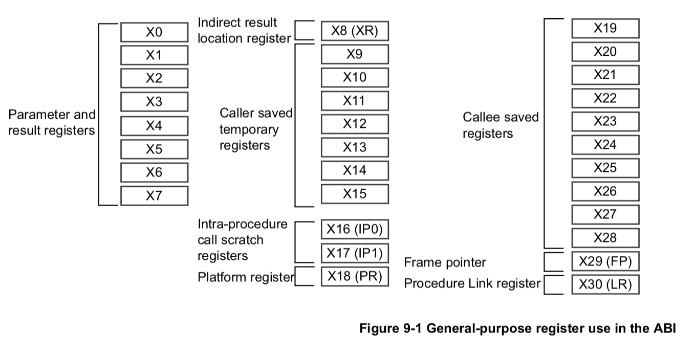

# 概述

## Raspberry Pi 简介

本实验的目标是将 RustOS 移植到 Raspberry Pi 3 Model B+ 上。其主要硬件参数如下：

| Raspberry Pi 3B+ | |
|-------|---------|
| 指令集 | ARMv8-A 32/64 bit |
| 片上系统(SoC) | Broadcom BCM2837B0 |
| 处理器(CPU) | 4 x Cortex-A53 1.4Ghz |
| 图形处理器(GPU) | Broadcom VideoCore IV |
| 内存 | 1GB (与 GPU 共享) |

## ARMv8 架构简介

### 运行状态

根据寄存器位数的不同，ARMv8 架构定义了两种**运行状态**(Execution States)，分别为 **AArch64** 与 **AArch32**。两种运行状态使用的指令集也不相同。RustOS 实现的是 AArch64。

### 异常级别

在 AArch64 下，可在 4 个**异常级别**(Exception level)中运行，分别为：

* EL0: Normal user applications.
* EL1: Operating system kernel typically described as *privileged*.
* EL2: Hypervisor.
* EL3: Secure monitor.

级别越高，特权(privilege)越高。一般称 EL0 为非特权级(unprivileged)，其他的为特权级(privileged)。

### 寄存器

#### 通用寄存器

AArch64 有 31 个 64 位**通用寄存器**(General-purpose registers) `X0~X30`，每个 64 位寄存器都有一个 32 位的版本 `W0~W30`。寄存器的使用规范一般如下：

* 参数寄存器 (Argument registers, `X0~X7`)：作为函数调用时的参数，返回值保存在 `X0`。
* 调用者保存寄存器(Caller-saved temporary registers, `X9~X15`)：在函数调用前，如果调用者需要保护这些寄存器中的值直到函数调用之后，则调用者需要将它们保存到当前栈帧上，而被调用者可直接使用而不必保存与恢复。
* 被调用者保存寄存器(Callee-saved registers, `X19~X29`)：在函数调用中，如果该函数需要修改这些寄存器，则需要在函数开始执行前将它们保存到当前栈帧上，并在返回时恢复它们。
* 帧指针寄存器(Frame point register, `FP` 或 `X29`)：用于保存当前函数的栈帧指针。
* 链接寄存器(Link register, `LR` 或 `X30`)：用于保存函数返回的地址，执行 `ret` 指令会跳转到 `LR`。



#### 特殊寄存器

AArch64 有下列**特殊寄存器**(Special-purpose registers)：

* 零寄存器(Zero register, ZR)：被映射为立即数 0，可分别用 `WZR/XZR` 访问 32/64 位版本。
* 程序计数器(Program counter, `PC`)：当前指令的地址，64 位。
* 栈指针(Stack pointer, `SP`)：当前栈顶地址，64 位。在每个异常级别下都有一个栈指针，分别为 `SP_EL0`、`SP_EL1`、`SP_EL2`、`SP_EL3`，直接访问 `SP` 时会根据当前异常级别自动选择对应的(如果 `SPSel = 0`，则在任何异常级别下都使用 `SP_EL0`)。
* 异常链接寄存器(Exception Link Register, ELR)：用于保存异常返回的地址，在异常级别 1~3 下分别为 `ELR_ELx`，执行 `eret` 指令进行异常返回时会根据当前异常级别跳转到相应的 ELR。
* 保存的进程状态寄存器(Saved Process Status Register, SPSR)：用于保存异常发生时的进程状态(PSTATE)，在异常级别 1~3 下分别为 `SPSR_ELx`。执行 `eret` 指令进行异常返回时会根据当前异常级别，从相应的 SPSR 恢复进程状态。

#### 进程状态

**进程状态**(Process state, PSTATE)是当前进程状态信息的抽象。AArch64 提供了一系列特殊寄存器来独立访问 PSTATE 中的每个字段，常用的几个如下(完整的字段描述参见 ARMv8 Reference Manual D1.7 节)：

* 条件标志位(Condition flags, `NZCV`)：

    + `N`: Negative Condition flag
    + `Z`: Zero Condition flag
    + `C`: Carry Condition flag
    + `V`: oVerflow Condition flag

* 异常屏蔽位(exception masking bits, `DAIF`)：

    + `D`: Debug exception mask bit
    + `A`: SError interrupt mask bit
    + `I`: IRQ interrupt mask bit
    + `F`: FIQ interrupt mask bit

* 当前异常级别(Current Exception level, `CurrentEL`)：获取当前的异常级别。
* 栈指针选择(Stack Pointer Select, `SPSel`)：如果为 1，则在不同异常级别下分别使用相应的 `SP_ELx` 作为 `SP`，否则任何时候都使用 `SP_EL0` 作为 `SP`。

当异常发生时，当前的 PSTATE 会根据进入哪个异常级别保存到相应的 `SPSR_ELx` 中。

#### 系统寄存器

可以通过**系统寄存器**(System registers)来进行 AArch64 的系统配置。一般每种系统寄存器在不同异常级别下都有相应的版本，用后缀 `_ELx` 表示。下表列出了常用的几个系统寄存器(全部系统寄存器参见 ARMv8 Reference Manual D12.1 节)：

|  系统寄存器_ELx  |                  名称                   |             描述             |
|------------------|-----------------------------------------|------------------------------|
|       CTR        |           Cache Type Register           |       获取 cache 信息        |
|       ESR        |       Exception Syndrome Register       |        发生异常的原因        |
|       FAR        |         Fault Address Register          |    发生访存错误的虚拟地址    |
|       HCR        |    Hypervisor Configuration Register    |     配置 EL2 下的虚拟化      |
|       MAIR       |  Memory Attribute Indirection Register  |         配置内存属性         |
|      MPIDR       |    Multiprocessor Affinity Register     |      多核系统中核的编号      |
|      SCTLR       |         System Control Register         |   提供对内存系统等系统配置   |
|       TCR        |      Translation Control Register       |    配置地址翻译系统的参数    |
|   TTBR0/TTBR1    |     Translation Table Base Register     |     设置翻译表(页表)基址     |
|       VBAR       |      Vector Based Address Register      |       设置异常向量基址       |

对系统寄存器(包括部分特殊寄存器)的访问需要使用 `mrs` 与 `msr` 指令：

* 读：

    ```armasm
    mrs x0, TTBR0_EL1
    ```

* 写：

    ```armasm
    msr TTBR0_EL1, x0
    ```

crate [aarch64](https://github.com/equation314/aarch64) 的 [regs](https://github.com/equation314/aarch64/tree/master/src/regs) 模块封装了对部分系统寄存器的访问。

#### SIMD/FP 寄存器

共有 32 个最高为 128 位的 **SIMD/floating-point 寄存器**，可分别通过 `Q0~Q31`、`D0~D31`、`S0~S31`、`H0~H31`、`B0~B31` 访问其 128、64、32、16、8 位版本。

使用这些寄存器需要 NEON 技术的支持。为了方便，在 RustOS 中禁用了 NEON (Cargo features `+a53,+strict-align,-neon`)，这样在处理异常时无需保存这些寄存器。

## 官方文档

* [ARM Architecture Reference Manual, for ARMv8-A architecture profile](https://static.docs.arm.com/ddi0487/da/DDI0487D_a_armv8_arm.pdf)：AArch64 的完整文档，有 7000 多页，最为详细。
* [ARM Cortex-A Series Programmer’s Guide for ARMv8-A](http://infocenter.arm.com/help/topic/com.arm.doc.den0024a/DEN0024A_v8_architecture_PG.pdf)：可认为是上一文档的精简版，仅有不到 300 页。
* [BCM2837 ARM Peripherals](https://web.stanford.edu/class/cs140e/docs/BCM2837-ARM-Peripherals.pdf)：Raspberry Pi SoC BCM283x 系列的外围设备文档，包含对 GPIO、中断控制器、mini UART、System Timer 等外围设备的访问。
* [BCM2836 ARM-local peripherals (Quad-A7 control)](https://www.raspberrypi.org/documentation/hardware/raspberrypi/bcm2836/QA7_rev3.4.pdf)：仅用于如何使用 AArch64 Generic Timer 的中断。
* [Raspberry Pi firmware](https://github.com/raspberrypi/firmware)：Raspberry Pi 二进制固件，部分开源，其中最有价值的是 [mailbox](https://github.com/raspberrypi/firmware/wiki) 的文档。

## 其他参考

* [Stanford CS140e](http://cs140e.stanford.edu/)：Stanford CS140e 课程，一个用 Rust 语言编写的 Raspberry Pi 3 操作系统，包含串口输入输出、文件系统、进程管理等功能，但没有虚拟内存管理。

* [Learning operating system development using Linux kernel and Raspberry Pi](https://github.com/s-matyukevich/raspberry-pi-os)：一个用 C 语言编写的 Raspberry Pi 3 操作系统，仿照 Linux，特点是文档非常详细。其中 Kernel Initialization、Interrupt handling、Virtual memory management 部分很有参考价值。

* [Bare Metal Rust Programming on Raspberry Pi 3](https://github.com/bztsrc/raspi3-tutorial)：另一个用 C 语言编写的 Raspberry Pi 3 操作系统。

* [Bare Metal Rust Programming on Raspberry Pi 3 (Rust)](https://github.com/rust-embedded/rust-raspi3-tutorial)：上一个项目的 Rust 版本，主要参考的是虚拟内存部分。
