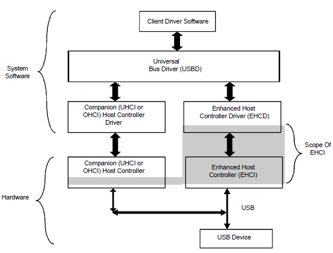

# 通用串行总线(USB)驱动

引用
--
USB HCD驱动代码：[github: LdB-ECM/Raspberry-Pi/Arm32\\_64\\_USB](https://github.com/LdB-ECM/Raspberry-Pi/tree/master/Arm32_64_USB)

概念介绍
--

### USB的传输模式（理解transfer mode的概念

- Low   Speed, 慢速 1.5 Mbits/s，在USB 1.0标准中提出，兼容至USB2.0标准
- Full  Speed, 全速  12 Mbits/s，在USB 1.0标准中提出，兼容至USB2.0标准
- High  Speed, 高速 480 Mbits/s，在USB 2.0标准中追加提出，由于处理器总线访问的限制，无法充分利用带宽
- Super Speed, 超速 5.0 Gbits/s，在USB 3.0标准中追加提出，USB 3.0需要设备安装后向兼容插件对旧设备兼容（backward compatible直译为后向兼容、对以往兼容，但意思是向前兼容）
- Super Speed+, 超速+ 10.0 Gbits/s，在USB 3.1 Gen 2标准中提出，速度是USB 3.0的二倍
- 总结
	- USB 1.X Low-speed Full-speed
	- USB 2.0 Low-speed Full-speed High-speed
	- USB 3.0 SuperSpeed
	- USB 3.1 SuperSpeed+

### USB的几个控制器标准（不同标准的USB控制器需要不同的USB HCD）

- OHCI标准：Open Host Controller Interface，OHCI for USB是OHCI标准之一，仅支持USB 1.1
- UHCI标准：Universal Host Controller Interface，由Intel提出，支持USB 1.X，该标准和OHCI不兼容
- EHCI标准：Enhanced Host Controller Interface，该标准同时兼容USB 2.0、UHCI和OHCI设备
- xHCI标准：Extensible Host Controller Interface，该标准支持USB 3.1 SuperSpeed+, USB 3.0 SuperSpeed, USB 2.0 Low-, Full-, and High-speed, USB 1.1 Low- and Full-speed
- WHCI标准：Wireless Host Controller Interface

**参考芯片说明，我们的USB Controller支持完整的OHCI和EHCI，也即支持USB 1.1和USB 2.0设备**

### USB总体架构说明

- 架构图
- USB架构从顶层到底层依次为（右侧）
	- 系统软件
		- 客户端驱动
		- 通用总线驱动
		- USB HCD（USB控制器驱动）
	- 硬件
		- USB控制器
		- USB设备

**我们需要实现的工作，就是自底向上的完成系统软件部分，从HCD到客户端驱动，中间的通用总线驱动在小系统中可以简单实现**

USB接口函数一览
--

<big><big>**在 kernel/src/arch/aarch64/board/raspi3/usb/rpi-usb.h 中有接口的注释**</big></big>

<pre>
/*--------------------------------------------------------------------------}
{                        PUBLIC USB DESCRIPTOR ROUTINES                     }
{--------------------------------------------------------------------------*/
    pub fn HCDGetDescriptor (pipe: UsbPipe,                         // Pipe structure to send message thru (really just uint32_t)
                         type0: usb_descriptor_type,                // The type of descriptor
                         index: u8,                                 // The index of the type descriptor
                         langId: u16,                               // The language id
                         buffer: *mut u8,                           // Buffer to recieve descriptor
                         length: u32,                               // Maximumlength of descriptor
                         recipient: u8,                             // Recipient flags
                         bytesTransferred: *mut u32,                // Value at pointer will be updated with bytes transfered to/from buffer (NULL to ignore)
                         runHeaderCheck: bool,                      // Whether to run header check
    ) -> RESULT;
/*--------------------------------------------------------------------------}
{                    PUBLIC GENERIC USB INTERFACE ROUTINES                  }
{--------------------------------------------------------------------------*/
    pub fn UsbInitialise() -> RESULT;
    pub fn IsHub(devNumber: u8) -> bool;
    pub fn IsHid(devNumber: u8) -> bool;
    pub fn IsMassStorage(devNumber: u8) -> bool;
    pub fn IsMouse(devNumber: u8) -> bool;
    pub fn IsKeyboard(devNumber: u8) -> bool;
    pub fn UsbGetRootHub() -> *mut UsbDevice;
    pub fn UsbDeviceAtAddress(devNumber: u8) -> *mut UsbDevice;
/*--------------------------------------------------------------------------}
{                    PUBLIC USB CHANGE CHECKING ROUTINES                    }
{--------------------------------------------------------------------------*/
    pub fn UsbCheckForChange();
/*--------------------------------------------------------------------------}
{                    PUBLIC DISPLAY USB INTERFACE ROUTINES                  }
{--------------------------------------------------------------------------*/
    pub fn UsbGetDescription(device:*mut UsbDevice) -> *const u8;
/*--------------------------------------------------------------------------}
{                        PUBLIC HID INTERFACE ROUTINES                      }
{--------------------------------------------------------------------------*/
    pub fn HIDReadDescriptor(devNumber: u8,                         // Device number (address) of the device to read 
                              hidIndex: u8,                         // Which hid configuration information is requested from
                              Buffer: *mut u8,                      // Pointer to a buffer to receive the descriptor
                              Length: u16,                          // Maxium length of the buffer
    ) -> RESULT;
    pub fn HIDReadReport(devNumber: u8,                             // Device number (address) of the device to read
                          hidIndex: u8,                             // Which hid configuration information is requested from
                          reportValue: u16,                         // Hi byte = enum HidReportType  Lo Byte = Report Index (0 = default)  
                          Buffer: *mut u8,                          // Pointer to a buffer to recieve the report
                          Length: u16,                              // Length of the report
    ) -> RESULT;
    pub fn HIDWriteReport(devNumber: u8,                            // Device number (address) of the device to write report to
                           hidIndex: u8,                            // Which hid configuration information is writing to
                           reportValue: u16,                        // Hi byte = enum HidReportType  Lo Byte = Report Index (0 = default) 
                           Buffer: *mut u8,                         // Pointer to a buffer containing the report
                           Length: u16,                             // Length of the report
    ) -> RESULT;
    pub fn HIDSetProtocol(devNumber: u8,                            // Device number (address) of the device
                           interface: u8,                           // Interface number to change protocol on
                           protocol: u16,                           // The protocol number request
    ) -> RESULT;
</pre>
