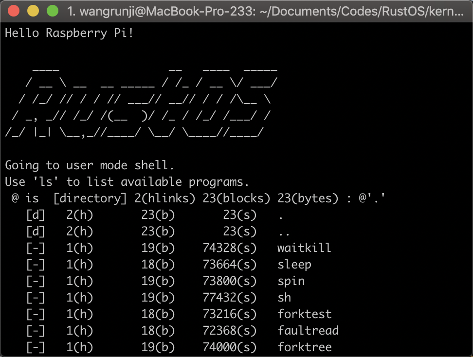

<!-- page_number: true -->
<!-- $width:12in -->
<!-- $height: 6.75in -->

# Rust版 uCore OS 的设计与实现
## Design and implementation of uCore OS in Rust

王润基
清华大学计算机系

2018.12.16 @ OS2ATC

---

# 提纲

## 简介：Rust uCore OS是什么？
## 动机：为什么要用Rust写OS？
## 体会：用Rust写OS有何好处？
## 未来：接下来会做什么？

---

# 简介：Rust uCore OS是什么？

---

# uCore OS

清华大学教学操作系统

参考 xv6 & jos in MIT, OS161 in Harvard, Linux

用C语言编写的宏内核OS

* [ucore_os_lab](https://github.com/chyyuu/ucore_os_lab)：操作系统课实验
* [ucore_os_plus](https://github.com/chyyuu/ucore_os_plus)：教学科研系统

---

# uCore OS in Rust -- RustOS

2018年操作系统课大实验项目

“用Rust语言重新实现uCore”

#

之后在OS专题训练课上推广，目前：

支持三大平台：x86_64, RISCV32, AArch64
支持硬件：计算所Labeled-RISCV，树莓派3B
支持多核CPU

---

## 大实验选题列举

OS：
* RustOS for x86_64 SMP
* Rustable - ucore 在 arm 平台的 rust 移植
* Rucore with LKM Drivers

OS专题训练：
* RustOS 上树莓派 USB 与 VideoCore IV 显卡驱动的移植
* RustOS 多核移植与基于PARD框架的线程级Label管理
* RustOS wiki完善与教学lab实验的制作
* RustOS 参考sv6的多核实现和优化
* RustOS 移植到 rv64 及llvm编译器支持

---

# 动机：为什么要用Rust写OS？

* C语言有何不足？
* Rust解决了哪些痛点？
* 条件是否成熟？

---

# C语言有何不足？

---

## 简单？简陋？

C语言简单、直接，为OS而生。
但从现代编程语言的角度看，C语言有些简陋，难以表达复杂逻辑和抽象。


*上图出自[一篇知乎回答](https://www.zhihu.com/question/25038841/answer/44396770)*

---

### 缺乏对OOP和接口的语言级支持
C中常用函数指针实现接口：
```c
struct device {
    size_t d_blocks;
    size_t d_blocksize;
    int (*d_open)(struct device *dev, uint32_t open_flags);
    int (*d_close)(struct device *dev);
    int (*d_io)(struct device *dev, struct iobuf *iob, bool write);
    int (*d_ioctl)(struct device *dev, int op, void *data);
};
```

---

### 缺乏基础数据结构支持

OS中常用的侵入式链表（摘自ucore_os_lab）：
```c
// 链表节点
struct list_entry {
    struct list_entry *prev, *next;
};
// 在宿主类型中嵌入链表节点
struct Page {
    list_entry_t page_link;
    ...
};
// 从list类型转化回宿主类型
#_define le2page(le, member) \
    to_struct((le), struct Page, member)
#_define offsetof(type, member) \
    ((size_t)(&((type *)0)->member))
#_define to_struct(ptr, type, member) \
    ((type *)((char *)(ptr) - offsetof(type, member)))
```

---

### 缺乏工程模块系统

* 编译配置复杂
* 难以复用代码

---

## SegmentFault！

悬空指针，重复释放，数据竞争……

#


---

# Rust解决了哪些痛点？

* 强类型，内存安全，线程安全——减少Bug！
* 现代语言特性——提升开发体验
* 完善的模块系统——方便代码复用
* 零开销抽象——能写OS的根本保障

---

# 是时候尝试Rust了！

### 社区：[Redox](https://www.redox-os.org)
全功能Rust OS，微内核架构，支持GUI

### 教学：[CS140e](https://web.stanford.edu/class/cs140e/)
斯坦福大学实验性OS课程，2018年新开设
Rust编写OS，面向ARM，在树莓派3上运行

### 兴趣：[Writing an OS in Rust](https://os.phil-opp.com)
手把手带你用Rust编写OS的系列博客
面向x86_64，教程极为详尽
作者为Rust编写OS提供了大量开源工具

---

## 万事俱备，只是……
# 还不会Rust怎么办？

编写OS是学习Rust的高效途径！

---

# 体会：用Rust写OS有何好处？

* 内存与线程安全：减少Bug
* 包管理系统：复用已有代码
* 接口与泛型：内核模块化
* 所有权和RAII机制：简化资源管理

---

# 安全！

类型系统 + 所有权机制 + 生命周期机制 

=> 内存安全 + 线程安全

---

## Rust如何减少Bug

### 消除了越界访问
=> panic

### 消除了因生命周期导致的非法访存
=> 编译错误

### 消除了数据竞争
=> 死锁

### 缩小了Bug的查找范围
=> unsafe块

---

## Rust如何减少Bug

* 大部分低级错误在编译期避免
* 少数逻辑错误在运行时暴露
* 难以发现的错误被限制了范围

---

## 充分利用现成轮子

引用的外部库（crate）：
* `alloc`: 容器
* `log`: 日志
* `spin`: 自旋锁
* `xmas-elf`: 解析ELF文件
* `linked_list_allocator`: 堆分配算法
* `uart_116500`: 串口驱动
* `x86_64`: 包装汇编指令，封装页表等数据结构

更好地专注于OS核心逻辑！

---

## 制造我们自己的轮子

仿照`x86_64`库，并基于社区现有成果，
我们分别实现了`riscv`和`aarch64`库。

---

# 内核模块化

ucore_os_lab = 内存管理 + 进程管理 + 文件系统

lab1-lab8，层层依赖，高度耦合。

然而它们在逻辑上互不相关，理应分开。

---

# 内核模块化

每个部分作为独立的crate存在，互不依赖。

内核通过实现它们的接口，把它们粘合在一起。

可以分别内部单元测试，然后放在一起集成测试。

配合泛型，可做到零开销。

---

### 内存模块

接口：页表，页表项，缺页处理函数

功能：面向进程的虚存管理（`mm_struct`）
-------支持内存置换、写时复制、延迟分配等机制

### 线程模块

接口：上下文切换，新线程的构造

功能：线程调度和管理

### 文件系统

接口：块设备，VFS（虚拟文件系统）

功能：文件操作和管理

---

### 内存模块——接口

```rust
pub trait PageTable {
    fn map(&mut self, addr: VirtAddr, target: PhysAddr) 
    	-> &mut Entry;
    fn unmap(&mut self, addr: VirtAddr);
    fn get_entry(&mut self, addr: VirtAddr) 
    	-> Option<&mut Entry>;
}

pub trait Entry {
    fn update(&mut self);  // flush TLB
    fn present(&self) -> bool;
    fn target(&self) -> PhysAddr;
    fn set_present(&mut self, value: bool);
    fn set_target(&mut self, target: PhysAddr);
    ...
}
```

---

### 内存模块——面向接口的上层实现

```rust
pub struct MemoryArea {
    start_addr: VirtAddr,
    end_addr: VirtAddr,
    ...
}

impl MemoryArea {
    fn map(&self, pt: &mut PageTable) {
        for page in Page::range_of(self.start_addr, self.end_addr) {
            let target = alloc_frame();
            pt.map(addr, target);
        }
    }
}
```
为一段连续的虚拟地址空间 映射页表项。

---

### 内存模块——接口的Mock实现
```rust
pub struct MockPageTable {
    entries: [MockEntry; PAGE_COUNT],
    data: [u8; PAGE_SIZE * PAGE_COUNT],
    page_fault_handler: Option<PageFaultHandler>,
}

impl PageTable for MockPageTable {
    fn map(...) {...}
    fn unmap(...) {...}
    fn get_entry(...) {...}
}

impl MockPageTable {
    fn read(&mut self, addr: VirtAddr) -> u8 {...}
    fn write(&mut self, addr: VirtAddr, data: u8) {...}
}
```
实现一个仿真页表，模拟地址转换的过程，从数组中存取数据。

---

### 内存模块——基于Mock的单元测试
```rust
#[test]
fn memory_area_map() {
    let mut pt = MockPageTable {...};
    let area = MemoryArea {...};
    
    area.map(&mut pt);
    
    pt.write(0x1000, 1);
    assert_eq!(pt.read(0x1000), 1);
}
```
可用`cargo test`在任意环境下运行单元测试，不依赖QEMU。

---

### 线程模块——接口与实现
```rust
pub trait Context {
    unsafe extern "C"
    fn switch_to(&mut self, target: &mut Context);
}
pub struct X86Context {
    rip: usize,
    ... // callee-saved registers
}
impl Context for X86Context {
    unsafe extern "C"  // Store caller-saved registers
    fn switch_to(&mut self, target: &mut Context) {
        // Store callee-saved registers
        // Restore callee-saved registers
    }                  // Restore caller-saved registers
}
```
上下文切换：保存和恢复寄存器

---

### 线程模块——面向接口的上层实现
```rust
/// 管理所有线程的状态及调度，全局唯一
pub struct ProcessManager {...}
/// 线程执行者，每个CPU核对应一个
pub struct Processor {
    manager: Arc<ProcessManager>,
    context: Box<Context>,
    ...
}
impl Processor {
    /// 调度线程，无限循环
    fn run(&mut self) -> ! { loop {
        let mut process = self.manager.pop();
        unsafe { self.context.switch_to(&mut process); }
        self.manager.push(process);
    }}
}
```
每个CPU核不断地从运行队列中：取出线程-运行-放回

---

### 线程模块——兼容标准库的高层封装

```rust
// thread.rs
pub fn current() -> Thread {...}
pub fn sleep(dur: Duration) {...}
pub fn spawn<F, T>(f: F) -> JoinHandle<T> {...}
pub fn yield_now() {...}
pub fn park() {...}
```
在上页基础上进一步封装。
提供和标准库`std::thread`完全一致的上层接口。
使得依赖std的多线程代码，可以方便地迁移到内核中。

---

# 所有权和RAII机制：简化资源管理

OS需要管理复杂的资源
资源之间有复杂的共享和依赖关系

---


---

进程的对象结构：
```rust
pub struct Process {
    context: Context,
    kstack: KernelStack,
    memory: MemorySet,
    files: BTreeMap<usize, Arc<Mutex<File>>>,
    ...
}
```

---

将资源封装成对象，在析构函数中释放资源。

```rust
pub struct KernelStack {
    ptr: *mut u8,
    layout: Layout,
}

impl Drop for KernelStack {
    fn drop(&mut self) {
        unsafe{ dealloc(self.ptr, self.layout); }
    }
}
```

---

当对象的生命周期结束时，资源自动释放。

```rust
pub struct Process {
    context: Context,
    kstack: KernelStack,
    memory: MemorySet,
    files: BTreeMap<usize, Arc<Mutex<File>>>,
    ...
}

pub struct ProcessManager {
    procs: BTreeMap<usize, Process>,
}
impl ProcessManager {
    pub fn remove(&mut self, pid: usize) {
    	self.procs.remove(&pid);
        // All resources have been released here
    }
}
```

---

# Rust vs C

## 代码风格

||Rust|C|
|-|-|-|
|数据结构|泛型容器（Vec）|侵入式（链表）|
|全局变量|少量|大量|
|数据分布|倾向分散|倾向集中|
|数据类型|鼓励自定义类型|基础类型|
|思维方式|所有权+生命周期|数据+行为|

---

## 代码量

||Rust|C|
|-|-|-|
|内存管理|1600|1800|
|线程管理|1200|1200|
|文件系统|1300|3400|
|同步互斥|500|400|
|内核其它|800|1200|
|共计|5400|8000|

*使用`loc`统计代码行数，基于RISCV版本，粗略计算*

---

## 语言能力

在底层：
* 具有同等的底层操作能力
* 二者具有良好的互操作性

在上层：
* Rust能编写更加安全的代码，减少Bug
* Rust具有更好的表达能力，胜任复杂逻辑
* Rust具有更强的抽象能力，有助于代码的分离和复用

——Rust更加适合编写OS！

---

# Rust的问题

学习曲线过于陡峭！

所有权、生命周期等机制难以驾驭！

初学者大部分时间在与编译器作斗争。

一种可能的解决方案：
* 先用unsafe、C风格实现
* 再逐步消除unsafe、重构成Rust风格

---

# 未来：接下来会做什么？

* 真机测试：HiFiveU, K210等RISCV64开发板
* 教学实验：2019年操作系统课实验
* 功能完善：实现POSIX接口
* 性能优化：发掘Rust的潜力
* 对比借鉴：其它有趣OS
* 潜力探索：async异步机制

---

## 其它有趣OS

### [Tock](https://www.tockos.org)

Rust编写的嵌入式操作系统

关注：Capsule内核模块设计，进程的内存分配策略……

### [Biscuit](https://github.com/mit-pdos/biscuit)

Golang编写的POSIX兼容OS，MIT出品

关注：Go异步机制，Go vs Rust

---

## 潜力探索：async无栈协程应用于OS内核的探讨

async-await：用户态异步编程机制

用同步的方式，编写异步的代码。

背后的实现机制和OS线程调度高度一致。

能否应用于Kernel中？与传统线程机制相比有何优缺点？

---

# 感谢

### 指导老师
陈渝，向勇

### 参与开发的同学们
王润基，戴臻旸，王纪霆
贾越凯，寇明阳，孔彦
刘辰屹，陈秋昊，朱书聪

---

# 欢迎试玩！


GitHub：https://github.com/wangrunji0408/RustOS

---

# 感谢聆听
# Q&A
