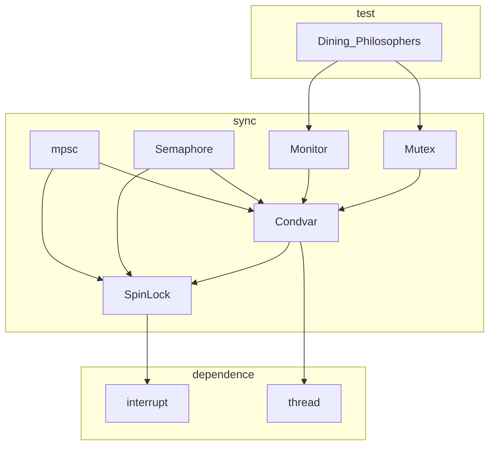

# 2018操作系统课程设计最终报告

## Rust OS for x86_64 SMP

计53 王润基 2015011279

2018.05.25 + 06.15

## 摘要

这是清华大学2018年操作系统课的课程设计项目，为期约两个月。本项目的初衷是尝试使用Rust这一新兴的系统级编程语言来写OS，并利用它主推的内存和线程安全特性，进行SMP多核优化。

由于时间有限以及对其复杂度的低估，在课程结束时实际完成的工作是：用Rust重新实现了uCore教学系统的大部分功能——我们的起点是《Writing an OS in Rust》系列文章的blog_os；x86平台相关部分的各个驱动从各种OS中摘取；进程管理部分完全重写，同时支持运行xv6_x86-64[3]和ucore[4]的用户程序；文件系统部分作为单独的模块重写，并实现了一个C语言兼容层以对接到ucore中。而SMP部分仅仅做到了启动多核，没来得及做深入研究和优化。

整个项目过程为使用Rust编写OS积累了诸多经验。Rust的安全哲学、类型系统、所有权机制对于编写OS大有助益。与C相比，在编写Rust时开发者更容易从高层的视角来看待问题，这对于控制一个复杂度极高的OS项目是很有帮助的。但是另一方面，Rust语言本身不能消除软件固有的复杂度，在脱离Rust约束的底层领域，依然需要谨慎的设计以防Bug的发生，这些是我们需要认识到的局限性。

我们期望这个项目在短期内实现uCore的全部功能，未来能够比肩甚至取代C语言版本的uCore成为新一代的教学操作系统，使之更加简洁、安全、模块化。

## 目录

[TOC]

## 实验概述

### 实验目标和完成情况

本项目最初的目标是：

在blog_os的基础上，移植ucore到Rust，然后参考sv6进行SMP优化。

1. 阅读《Writing an OS in Rust》，以blog_os为案例学习RustOS的风格。 
2. 阅读xv6，xv6-x86_64，ucore_os_lab，ucore_plus代码，学习x86_64下SMP的实现细节。 
3. blog_os已经实现了64位下的内存管理和中断，还需实现线程、调度、文件系统。 
4. 实现SMP，参考sv6进行优化，使用commuter进行测试。

我们计划在第7-10周和其它Rust组合作完成uCore的移植，第11-13周完成SMP的实现和优化。

但是，由于以下原因，项目只完成了预定计划的一半：

* 时间紧张，人手短缺
* 低估了OS的复杂度和Debug消耗的时间
* 初始框架不完善以及OS的高耦合性导致难以组间合作

截止第13周，项目移植完成了uCore的整体框架和大部分功能：

* 基础驱动：全部完成
* 内存管理：框架完成，一些算法没有实现
* 进程管理：近乎完成，可以正常运行大部分用户程序
* 同步互斥：没写
* 文件系统：SFS和VFS作为单独模块实现完毕，还没对接到进程中

到第16周，完成了同步互斥部分，并对内存管理进行了整合优化。

具体完成过程和内容参见下文，各部分完成情况清单参见[status.md](../status.md)。

### 前期调研情况

最开始时，在老师的指示下，我们首先调研了Rust for RISCV的可能性。在2017年底才刚刚有了RISCV-Rust-Toolchain，也有人成功用它在HiFive上运行。但我们和老师都没法在本机上把这套工具链跑起来，而且它刚刚诞生十分不稳定，于是我们放弃了RISCV这条道路。

在此项目开始时，开源界已经有不少RustOS的项目：

* Redox：这是目前完成度最高的RustOS，微内核架构，平台x86_64
* 《Writing an OS in Rust》& blog_os：这是一个从零开始写RustOS的教程，平台x86_64
* rv6：这是一个xv6的Rust移植，然而它止步于内存管理，并且是完全C风格的
* CS140e：这是斯坦福2018年新开的实验性课程，用Rust写的教学OS，平台arm/RaspberryPi

综合考虑，我们决定在blog_os的基础上移植/补全ucore的功能。

在第7周方案报告时，我们已经读完了《[Writing an OS in Rust](https://os.phil-opp.com)》第一版的全部10篇博客，建立起了开发环境，并开始移植一些驱动，同时熟悉Rust语言和生态。值得一提的是，我们实现了Rust和C语言互操作，这使得我们对移植工作多了几分信心。

关于前期调研的其它内容，详见[中期汇报文档](./MidReport.md)。

### 小组成员分工及组间合作情况

由于某些原因，我的队友朱书聪同学中途跑路了，于是我完成了99%的实际开发工作。

同期进行课程设计的还有两个Rust组：

* 第13组（ARM组）：他们的工作基于CS140e的框架，把uCore移植到ARM上。
* 第15组（驱动组）：他们和我们一样基于blog_os的框架，重点在驱动和内核可加载模块上。

我们三个组之间没有显式地合作，即各自维护独立的代码仓库。

我们在第7周进行过一次讨论，结论是很难维护一个主代码。

* 对比ARM组，我们双方的起点完全不同，CS140e提供了一个完整的OS框架，而blog_os只提供了中断和页表管理。并且当时我们对OS刚刚上手，完全无法进入对方的平台把框架统一起来。
* 对比驱动组，我们基于共同的起点，但这个起点太低了，难以并行地开发。比如uCore都是每个lab依赖于之前所有lab，我们的起点相当于不到lab1。虽然如此，但事实上在之后我们两组共享了绝大部分代码，其实应该merge一下的……

因此，我们之间的合作仅限于互相借鉴，把别的组写好的可以复用的部分拿过来用。比如我们借用了驱动组写好的IDE驱动，参考了ARM组的进程管理框架。

## 实际完成的工作

在这两个月共8周的时间中，前两周主要是调研和熟悉环境，后五周完成实际开发。共累计180次commits，为此投入了150h以上的精力。没有功劳也有苦劳啊~

以下大致按时间顺序列举了完成的主要工作，详细内容可查看日志：

### 1. 将内核移到高地址区

blog_os的内核位于低地址区，它在进入Rust前的汇编中设置了一个将最低1G空间恒等映射的页表，并在进入Rust后根据内核实际占用的空间构造了一个新的页表，这一操作称为内核重映射，目的是防止栈溢出并精细地管理内存。

在此基础上，我做了以下改动：

* 修改linker script，将Kernel的虚地址重置到高地址区，但实地址不变。

* 修改初始页表，将四级页表第510项（内核虚地址区）也映射到低1GB物理空间。

  由于BootLoader开始时还处于32位保护模式，不能使用64位的虚地址，因此在进入Rust之后才能把页表第0项撤销掉。

* 修改BootLoader，使之进入Rust时rip和rsp都使用新的虚地址。

这里遇到了以下问题：

* 链接时由于段名称错误导致属性不正确，最终导致了PageFault
* 32位跳转到64位写法不正确，链接时报错：relocation truncated to fit: R_X86_64_PC32

### 2. 设备和多核的初始化 

blog_os只实现了中断处理，还没有实现对设备的操作。

我完成了以下设备的初始化：

* ACPI：参考xv6 x86_64，用Rust重写
* LocalAPIC：链接C代码
* IOAPIC：参考xv6 x86_64，用Rust重写
* PIT时钟：复制Redox代码
* IDE：后期借用驱动组的成果
* 键盘：链接C代码
* 串口：复制Redox代码
* VGA：blog_os写好了
* 启动多核：参考xv6 x86_64，用Rust重写

这时基本达到了lab1的程度。

### 3. SFS文件系统

由于文件系统是OS无关的，我把它分离出来作为一个Rust库来写，[Github](https://github.com/wangrunji0408/SimpleFileSystem-Rust)。

它内部分为四层，由低到高：硬盘数据结构层，SFS层，VFS层，C兼容层。除此之外，还附有单元测试和mksfs命令行工具（未完工）。

目前，该模块已经通过C兼容层链接到了uCore上，可以替换C语言的实现；在RustOS中直接操作VFS层实现了从磁盘中读取用户程序。日后，在此框架下可以用Rust实现更多FS，只要它们实现Rust的VFS接口，就可以同时被RustOS和uCore使用。

这部分的开发主要分为两个阶段：SFS层和C兼容层。前者专注于SFS的逻辑，几乎不含底层细节，用Rust写起来非常顺畅；后者则要经常和C语言接口打交道，充满了各种unsafe操作，实现起来比较艰难，此外还需要考虑如何让双方的接口配合起来工作，相当有挑战性。

这部分开发过程历时一周，实际有效代码约1300行（其中C兼容层就占了450行，和SFS层相当），而代替掉的uCore代码约1000行。并没有比想象中要少。

更多详细内容，参见[SFS移植报告](https://github.com/wangrunji0408/SimpleFileSystem-Rust/blob/master/docs/rust_port_report.md)。

### 4. Re: 从零开始的进程管理

这部分是整个项目中最难的一块。它的复杂度和SFS相当，同时又和底层机制紧密耦合，依赖于内存管理和中断处理。blog_os在进程管理上是白纸一张，需要从头写起。我主要参考了xv6和uCore，分阶段完成了这个模块：

1. 借用Redox的中断处理入口函数，保存下TrapFrame。
2. 建立最简单的进程控制块`Process`和调度器`Processor`，为一个内核函数构造TrapFrame，通过直接改写中断时的tf，使之返回到新的内核线程。
3. 为每个线程分配内核栈，中断时不再改写tf，而是在中断处理结束时修改rsp，来实现线程切换。
4. 仿照Lab1 Challenge，新建两个软中断ToU/ToK，手动切换内核态和用户态。
5. 将一个xv6二进制用户程序链接到Kernel，使用一个ELF解析库读出其各段信息。
6. 在内存管理模块中新增类似mm和vma的内存描述结构`MemorySet`，并实现从ELF段信息的转换，和它在页表上的映射。
7. 为用户程序构造TrapFrame和页表，反复调试直到可以执行用户程序。
8. 实现一个最基础的系统调用，使得用户程序可以回到内核态。注意需要在每次进入用户态前在TSS中设置返回内核态时的内核栈rsp。
9. 实现Fork系统调用，需要谨慎处理页表切换。
10. 学习x86_64下的32位兼容模式，使得可以运行uCore的32位用户程序。
11. 为了方便测试各个用户程序，把整个sfs.img链接进来，通过之前写好的SFS模块读取所有用户程序。
12. 实现一个简易事件处理器，支持程序的睡眠和唤醒。
13. 为了在用户程序发生异常时中止其运行，发现Redox版本的中断处理不统一，遂废弃之改用xv6/uCore的实现，修改后直接修复了一个长期阴魂不散的Bug。
14. 将散落在各处的对rsp的修改统一到中断处理的最后。
15. 发现sys_wait是一个异步操作，需要把`(int*)store`保存下来，等到某个程序exit后再赋值。修改后通过了`waitpid`函数的测试。
16. 阅读xv6文档后惊讶地发现，它是通过switch函数直接在内核态切换线程来实现调度的（这意味着我前四周ucore也没学明白），在这种机制下上面的问题就不再是问题了。于是我又引入了switch机制，修改了新进程的初始内核栈内容，中断处理时就不再修改rsp了。
17. 参考uCore的调度模块，实现了RRScheduler和StrideScheduler。

至此，RustOS已经支持了绝大多数uCore用户程序的运行，具体清单见[status.md](../status.md)。

整个开发过程历时两周。平台无关部分的实际有效代码约800行，平台相关部分（构造TrapFrame和switch）约100行，比C语言的代码量少一些（syscall 200 + schedule 300 + proc 800 = 1300）。

现在完成后再回头看，发现其实进程模块的依赖相当少：

* 中断处理部分：只需特定平台提供switch函数，以及一个新线程的初始内核栈内容。
* 内存管理部分：只需提供页表构造、复制（以及数据的复制）和切换操作。

于是我就想，可不可以把进程管理也做成OS无关的独立模块（Rust extern crate），通过接口提供必要的依赖支持呢？……

### 5. 支线任务

以上是这两个月完成的主要工作，接下来列举一些中途穿插完成的小任务，有些是为更好地开发而进行的基础性工作，有些是没有进入主分支的尝试性工作：

#### 5.1 C语言互操作

Rust调用C：

* 对于完整的C语言库，Rust提供了[Bindgen](https://rust-lang-nursery.github.io/rust-bindgen/)工具来自动生成绑定代码。
* 对于零星的几个函数，直接使用extern导入函数符号即可。

C调用Rust：

* 在Rust中使用`extern "C"`来定义函数，并加上`#[no_mangle]`禁止改名，在库的顶层声明为pub即可导出。

#### 5.2 TravisCI 

blog_os自带了一个travis脚本，我在此基础上进行了扩展，使之支持集成测试。

为了能在travis上运行QEMU并获得结果，需要一个从内部退出QEMU的方法：

- 运行qemu时加入 -device isa-debug-exit
- 执行outb(0x501, k)，会退出qemu，错误码为2k+1

#### 5.3 未被整合的内存管理模块

在实现SFS文件系统前，我试图把内存管理模块也作为独立的库来写，因为貌似除了页表外其它算法都是平台无关的。

于是我新开了[一个库](../crate/memory/)，在里面定义了一个页表接口，并针对此实现了两个页交换算法。为了对它们单元测试，还写了一个假的页表。结果当我想把它引入OS时遇到了阻碍：整个OS对现有代码高度依赖，很难一口气把它们抽离出去，于是不了了之。现在想来这么做是行不通的，或许应该渐进式地抽象出接口，而不是造出一个空中楼阁硬往里套。

#### 5.4 Copy-on-write

在实现进程Fork时，被一个Bug卡了好久，于是那天我换了个方向，为页表实现了写时复制机制。

本来这个功能也是计划写在上面提到的独立模块里的，但由于合不进来就没敢这么做。

借助Rust的语言支持，我可以把与这个拓展相关的全部内容（代码、文档、测试）写在[一个文件](../src/arch/x86_64/paging/cow.rs)里。由于要为每个物理帧维护额外的引用计数信息，还开了一个全局的Map（不像uCore对每个帧都建立信息块放在一起）。

#### 5.5 CLion配合gdb调试 & 调试经验

CLion配合gdb调试的方法：详见日志2018.05.18的记录

不过这个方法用得不多。在大部分情况下，OS都会触发TripleFault直接重启，此时就需要借助QEMU来进行Debug：

- 运行QEMU时加入参数-d int，即可显示每次中断时的CPU信息
- 发生PageFault时，检查RPI（出错位置），CR2（访存目标），错误码（出错原因）
- 在反汇编中查看rip对应的代码（可用`make asm`命令）

#### 5.6 日志模块和彩色输出

Log模块是软件开发中一种常用的库，它可以支持在程序各处记录不同等级的日志，汇总到一起统一输出。我在RustOS中引入了这个库，并实现了根据不同日志等级以不同的颜色进行输出，还支持在运行前对指定等级的日志进行过滤，方便debug。

### 6. 同步互斥

在内核线程调度的基础上，实现了用于内核态的同步互斥工具。这部分参考了spin模块和Rust标准库中的sync模块，并提供和std::sync完全相同的接口。作为测试，仿照uCore，用这些工具在OS内实现了哲学家就餐问题。

各模块依赖关系如下：



Rust中提供同步互斥的最底层支撑是核心库中的原子变量`AtomicBool`，用它即可实现最简单的自旋锁`spin::Mutex`。自旋锁已经可以满足OS内核中的大部分需求，但如果在中断和非中断态都访问同一个锁，就可能造成死锁问题，这就需要在上锁期间关闭中断。此外，还要实现支持线程调度的锁，在无法获得锁时，将当前线程加入等待队列并放弃CPU，在用锁完毕时唤醒一个等待的线程。我通过将`spin::Mutex`修改为一个可替换底层支持的锁框架，实现了上述两个需求。在此基础上，又实现了信号量、条件变量、信息传递通道，形成了比较完善的同步互斥工具组。这部分共计约400行代码。

## 实验总结

在整个移植过程中，我并不会直接照搬C语言的实现，而是去参考其他RustOS的设计，尽量使用Rust的风格和视角去重新审视OS。

接下来列举了一些我感受较深的Rust特性，并尝试去分析这些特性是如何帮助OS开发的：

#### Rust的安全“哲学”

Rust保证安全的方式是尝试把系统正确性证明整合到语言本身当中来。Rust的类型系统充当了specification的角色，而Rust编译器则是进行“证明”的工具。凡是遵守这套规则的代码，Rust保证它一定是内存安全的。

另一方面，Rust也是一个注重效率和实际的语言，因此在某些场合下必须绕过这些约束（由于OS中需要直接控制内存，这种需求大量存在）。针对这一现实，Rust提供了unsafe块，在它内部可以自由地通过指针访存。这背后的哲学是：显式地指出不安全，并使用安全封装和管理不安全。

因此在实际操作中，应该尽量减少unsafe块的数量，并把他们集中封装起来，对外提供安全的接口，最好还要在文档中论证为什么这样做是安全的。

Rust从不会放松对安全的要求，但出于实际考虑，它可以允许把编译时约束转移到运行时（例如Mutex，RefCell），也允许把安全保证甩锅给程序员（unsafe块）。

unsafe块是一个精妙的设计，它总是在你想偷懒破坏安全性的时候给你带来小小的骚扰，这种不爽敦促你要赶快消灭它，于是程序的安全性就在日常点滴中得到了保证。例如你定义了一个可变的全局变量，那么所有对它的访问都需要用unsafe包起来，于是你就会考虑能不能不用这个全局变量，或者用Mutex把它包起来。在C/C++中可不是这样，定义全局变量、忘记访问时加锁，就像吃饭喝水一样自然。等一上多线程才发现大事不妙，后悔自己当初的放纵。正如知乎某答案所描述：“Rust：编译时想撞墙；C++：调试时想跳楼”。

#### 实现安全的工具：类型系统

为Rust提供安全保证的工具是其强大的类型系统（类似Haskell），它鼓励开发者使用自定义类型封装各种概念，并通过特性`Trait`约束类型的行为，以达到类似Coq形式化证明的效果。

一个印象深刻例子是《Writing an OS in Rust》作者实现的x86_64页表，它是如此优秀以至于被Redox全盘采用。接下来简单介绍一下它的实现，感受一下如何让编译器帮我们防止Bug的发生。

首先我们来列举一下页表中有哪些概念，以及可以做哪些事情：

* 在x86_64的四级页表下，一个常用的技巧是将根页表最后一项映射到自己，这样就可以通过虚地址访问任意级的页表。如果要编辑一个非活跃的页表I（不是CR3所指向的那个），需要先将活跃页表A的最后一项指向I，编辑过后再恢复回来。在编辑过程中，不能修改A本身。（也就是根页表最后一项独占所有页表的“编辑权”）
* 活跃页表只能有一个，在重置CR3后，被换上的非活跃页表与原来的活跃页表互换。
* 前三级页表的项指向下一级页表，而最后一级页表项指向被映射的页。

在blog_os中，作者定义了若干类型来完成这些约束：

* `Mapper`：表示一个可以被编辑的页表，内部记录了根页表的物理地址，实现了各种map/unmap方法。

* `InactivePageTable`：表示一个非活跃页表，内部记录了根页表的物理地址，它没有任何方法。

* `ActivePageTable`：表示当前活跃页表，内部是一个Mapper。

  * 它“继承”（Deref）Mapper的所有方法，表明可以直接编辑它。

  * 它提供一个switch方法，用来和一个非活跃页表互换：

    ```rust
    fn switch(&mut self, new_table: InactivePageTable) -> InactivePageTable
    ```

    内部的实现是切换CR3，并把自己作为InactivePageTable返回出去。

  * 它提供一个with方法，用来编辑非活跃页表：

    ```rust
    fn with(&mut self, table: &mut InactivePageTable, f: impl FnOnce(&mut Mapper))
    ```

    其中第三项是一个调用者提供的函数，在里面可以把table当做Mapper来编辑。

* 在Mapper内部，还定义了`Table<Level>`类型，其中Level是一个枚举类型的泛型参数，可以取1234四种值。对于`Table<2/3/4>`都实现了`next_table`等方法，返回的类型分别是`Table<1/2/3>`，而`Table<1>`就没有。这波操作直接在编译期保证了使用者不会犯错。

更详细的说明可以参阅[《Writing an OS in Rust》post 6](https://os.phil-opp.com/page-tables/) 。

#### 所有权机制与资源管理

Rust将C++中的RAII和移动语义发扬光大，形成了所有权机制，并衍生出借用机制、生命周期机制，在不牺牲性能的情况下保证安全。

由于OS中涉及复杂的资源管理，所有权机制在此大有可为。上面提到的页表就是一个例子。除此之外，物理页帧、内核栈、内存空间、线程、CPU等等概念都与资源相关。而对于共享资源，例如共享内存段，Rust中也有现成的解决方案（例如Rc引用计数指针，Cow写时复制对象）。我在写RustOS时就尽量使用资源对象，这样就能自动回收资源，或在发生泄漏时及时得到警告。

所有权机制导致的另一个结果就是Rust中的对象有严格的层级关系，上层拥有下层的所有权。这使得结构更加清晰，但丧失了一定的灵活性，而且经常出现深层嵌套。

例如锁`Mutex<T>`，它就“拥有”里面的具体类型T，你想访问里面的内容，就必须先从外部开锁`mutex.lock()`，如果此时没有其它人使用，就会返回一个`MutexGuard<T>`，这个对象拥有T的“访问权”，你可以通过它操作T。当MutexGuard离开作用域销毁时，会自动调用析构函数给mutex解锁。

反观C，给人的感觉是所有的对象都是平行地散落在内存各处，它们之间只是互相引用，而要说谁控制谁，那只有开发者才知道。假如开发者也糊涂，就会出现内存泄漏或是重复释放。C中的锁和被锁对象往往是平级关系，上锁这件事需要文档来说明，这导致我们经常忘了上锁。

#### 模块化

Rust提供了完善的包管理系统和模块系统，可以很方便地实现模块化。C语言由于缺乏完善的接口机制，也没有泛型，模块化搞起来比较别扭。

但是对于OS这种高度耦合的系统，实现模块化仍然相当困难。我在本次实验中进行了模块化的尝试，其中文件系统部分成功独立出去，进程管理部分看起来有些希望，而内存管理部分则困难重重。

不过，对于驱动和辅助性代码（例如读取ELF），使用外部模块是完全可行的。这方面《Writing an OS in Rust》的作者起到了很好的带头作用。他在写blog_os的同时就顺手写了一些库，都很好用。他还在GitHub上建立了一个组织[Rust-OSDev](https://github.com/rust-osdev)，专门提供各种库。上面提到的页表，马上就会进入下一版的[x86_64库](https://docs.rs/x86_64/0.2.0-alpha-019/x86_64/)，届时又可以精简掉RustOS大约500行的代码了！

## 后期计划

（如果还干的动的话……）

1. 完成uCore所有8个lab功能的移植
2. 提供完整的文档，达到和uCore同样的可用度和可读性
3. 完成xv6所有功能的移植，主要是多核运行程序
4. 学习借鉴sv6搞SMP优化
5. 把进程管理和内存管理模块化
6. 尝试和ARM组合并

## 日志

详见[日志文档](./Log.md)

## 参考代码和文献

1. [Writing an OS in Rust](https://os.phil-opp.com/)：从零开始用Rust写OS的详细教程

   整个项目在此blog第一版[post10](https://github.com/phil-opp/blog_os/releases/tag/post_10)的基础上开发

2. [Redox](https://github.com/redox-os/redox)：开源界完成度最高的RustOS

   参考了它的代码结构，直接复制了一些设备驱动代码

3. [xv6-x86_64](https://github.com/jserv/xv6-x86_64)：xv6的x86_64移植版

   [xv6中文文档](https://th0ar.gitbooks.io/xv6-chinese/content/)

4. [ucore_os_lab](https://github.com/chyyuu/ucore_os_lab)：

   [ucore_os_docs](https://legacy.gitbook.com/book/chyyuu/ucore_os_docs)

5. CS140e：